# 🏥 MediAssist AI — Clinical RAG Assistant with Vision, Voice & AYUSH Intelligence

<div align="center">

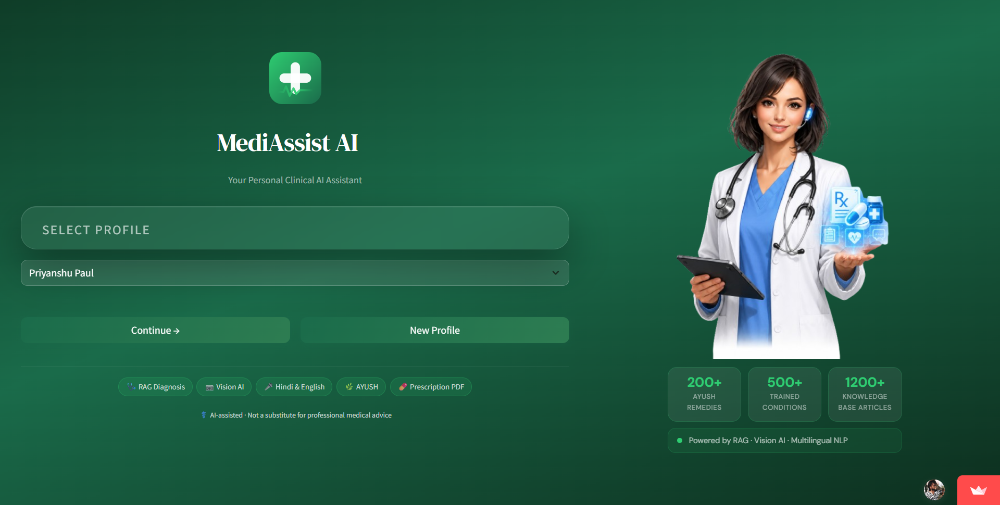

**A production-grade, multimodal RAG healthcare assistant that combines retrieval-augmented generation, computer vision, multilingual voice I/O, and traditional Ayurvedic intelligence — built to reason like a physician and respond like a caring doctor.**

[](https://python.org)
[](https://streamlit.io)
[](https://ai.google.dev)
[](https://langchain.com)
[](https://www.trychroma.com)
[](https://sbert.net)
[](https://reportlab.com)
[](LICENSE)

[🚀 Quick Start](#-getting-started) · [🏗️ Architecture](#-system-architecture) · [🧠 RAG Pipeline](#-rag-pipeline--the-intelligence-core) · [📷 Vision AI](#-computer-vision-pipeline) · [🌿 AYUSH](#-ayush--ayurvedic-intelligence-module) · [🔒 Security](#-security-architecture)

</div>

---

## 📌 Table of Contents

- [Overview](#-overview)
- [Why MediAssist AI?](#-why-mediassist-ai)
- [Interface](#-interface)
- [System Architecture](#-system-architecture)
- [The Full Pipeline](#-the-full-pipeline--under-the-hood)
- [RAG Pipeline — The Intelligence Core](#-rag-pipeline--the-intelligence-core)
- [Computer Vision Pipeline](#-computer-vision-pipeline)
- [Voice Pipeline](#-voice-pipeline--hindi--english)
- [AYUSH — Ayurvedic Intelligence Module](#-ayush--ayurvedic-intelligence-module)
- [Security Architecture](#-security-architecture)
- [`core/` — RAG & Intelligence Layer](#-core--rag--intelligence-layer)
- [`modules/` — Specialised AI Modules](#-modules--specialised-ai-modules)
- [`ui/` — Streamlit Interface Layer](#-ui--streamlit-interface-layer)
- [`utils/` — Utilities & Generators](#-utils--utilities--generators)
- [`data/` — Persistence Layer](#-data--persistence-layer)
- [Knowledge Base](#-knowledge-base--medical-corpus)
- [Getting Started](#-getting-started)
- [Environment Variables](#-environment-variables)
- [Deployment](#-deployment)
- [Tech Stack](#-tech-stack)
- [Developer](#-developer)

---

## 🧠 Overview

**MediAssist AI** is a full-stack, production-grade clinical AI assistant that goes far beyond a typical chatbot. It is a **multimodal RAG pipeline** grounded in WHO, MedlinePlus, and global medical guidelines — capable of reasoning about symptoms, analyzing medical images, transcribing voice in Hindi and English, generating downloadable prescriptions, and suggesting Ayurvedic alternatives alongside allopathic treatment.

The system is architectured around four intelligence layers that operate in concert:

| Layer | What it does |
|---|---|
| **RAG Engine** | Retrieves evidence-based medical context from a 9,677-chunk ChromaDB knowledge base before every response |
| **Vision AI** | Analyzes uploaded photos of skin conditions, wounds, and lab reports using Gemini 2.5 Flash multimodal |
| **Voice I/O** | Transcribes Hindi and English speech via Google Cloud STT / Whisper and reads responses aloud via gTTS |
| **Clinical Logic** | Classifies triage severity, generates differential diagnoses, checks drug interactions, and produces prescription PDFs |

Every response is grounded — not generated from parametric memory alone. Every prescription is checked against patient allergies. Every clinical assessment is tagged with a triage severity. This is not a wrapper around an LLM. It is a **structured clinical reasoning pipeline**.

---

## 🎯 Why MediAssist AI?

> **The problem:** In India, 1.3 billion people share roughly 1.2 million registered doctors. Rural populations often travel hours for basic consultations. Language is a barrier — millions cannot comfortably describe symptoms in English. Medical records are scattered, paper-based, or non-existent.

> **The solution:** MediAssist AI puts a knowledgeable, empathetic, multilingual clinical assistant in every smartphone — one that remembers your history, understands your image, speaks your language, and writes a proper prescription.

| Without MediAssist AI | With MediAssist AI |
|---|---|
| Wait days for a GP appointment | Instant clinical assessment, 24/7 |
| Describe symptoms only in English | Full Hindi + English voice and text support |
| No memory of past consultations | Complete history-aware RAG context |
| Generic internet search results | Evidence-based answers from WHO / MedlinePlus |
| Cannot analyze a photo of a rash | Gemini Vision analyzes the image clinically |
| Manual prescription writing | Structured PDF prescription, instantly downloadable |
| No Ayurvedic alternatives | AYUSH module with 200+ curated remedies |
| Everyone on same device sees your data | Device-ID + bcrypt PIN isolation |

---

## 🖥️ Interface

MediAssist AI is built with **Streamlit**, extended with a production-grade custom CSS layer that delivers a clinical green-and-white UI far beyond Streamlit's default aesthetic.

> 📸 **Landing Page:**
> 


### Design System
- **CSS variables** for a fully cohesive light theme (`--primary`, `--accent`, `--card`, `--border`, `--muted`)
- **DM Sans** (body) + **DM Serif Display** (headings) for a professional medical aesthetic
- **Glassmorphism card** on the landing page with `backdrop-filter: blur(20px)`
- **Triage badges** color-coded: 🟢 Mild · 🟡 Moderate · 🟠 Severe · 🔴 Emergency
- **Chat bubbles** — dark green gradient for patient, white card for assistant, directionally oriented
- **Native Streamlit sidebar toggle** restyled as a green hamburger button — no Python reruns

---

## 🏗️ System Architecture

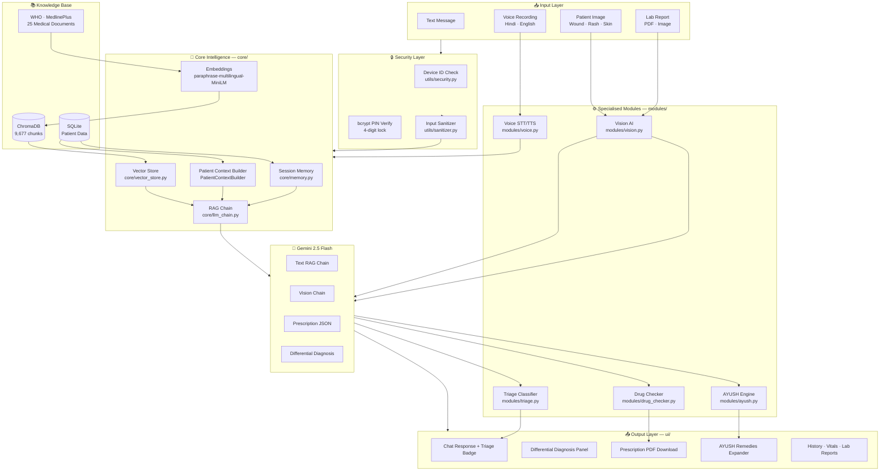

---

## ⚙️ The Full Pipeline — Under the Hood

Every user message passes through a deterministic, multi-stage pipeline before a response is returned. No stage is skipped.

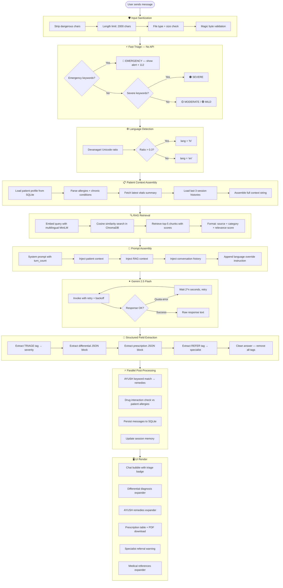

---

## 🧠 RAG Pipeline — The Intelligence Core

The RAG (Retrieval-Augmented Generation) system is what separates MediAssist AI from a plain LLM wrapper. Every response is grounded in evidence retrieved from a curated medical knowledge base — not generated from parametric memory alone.

### Knowledge Base Construction

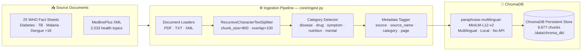

**Why `paraphrase-multilingual-MiniLM-L12-v2`?**

This sentence transformer was chosen over Google's `text-embedding-004` API for three critical reasons:

1. **Multilingual by design** — supports 50+ languages including Hindi natively. When a Hindi query arrives, the same embedding model handles it without translation
2. **Zero API cost** — runs entirely on CPU locally. A 9,677-chunk knowledge base would cost significant API credits to embed via Google's API
3. **No rate limits** — ingestion of all 25 documents completes in one uninterrupted pass without quota concerns

### Retrieval Strategy

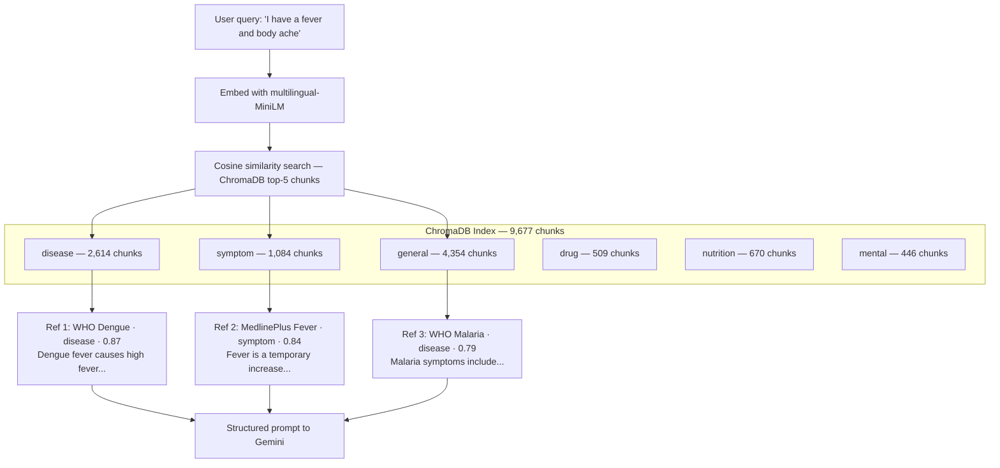

Each retrieved chunk is formatted with source attribution, category, and relevance score before injection into the prompt. This gives Gemini full traceability of where each piece of medical evidence came from.

### The RAG Chain (LCEL)

```python
# core/llm_chain.py — simplified representation
rag_pipeline = (
    PatientContextBuilder.build()        # patient chart from SQLite
    | VectorStore.format_context(query)  # top-5 retrieved chunks
    | SessionMemory.get_history_text()   # last 10 conversation turns
    | SYSTEM_PROMPT.format(...)          # assembled prompt
    | ChatGoogleGenerativeAI(...)        # Gemini 2.5 Flash
    | ResponseParser()                   # extract triage + diff + prescription
)
```

### Turn-Aware Prescribing

One of MediAssist AI's most clinically important behaviors: the system prompt passes `{turn_count}` to Gemini, which controls prescribing behavior:

| Turn | Behavior |
|---|---|
| 1–2 | Gather history — ask focused clarifying questions |
| 3+ | Full clinical assessment + automatic prescription generation |

This mirrors how a real doctor operates: they don't prescribe on the first sentence. They listen, ask, then decide.

---

## 📷 Computer Vision Pipeline

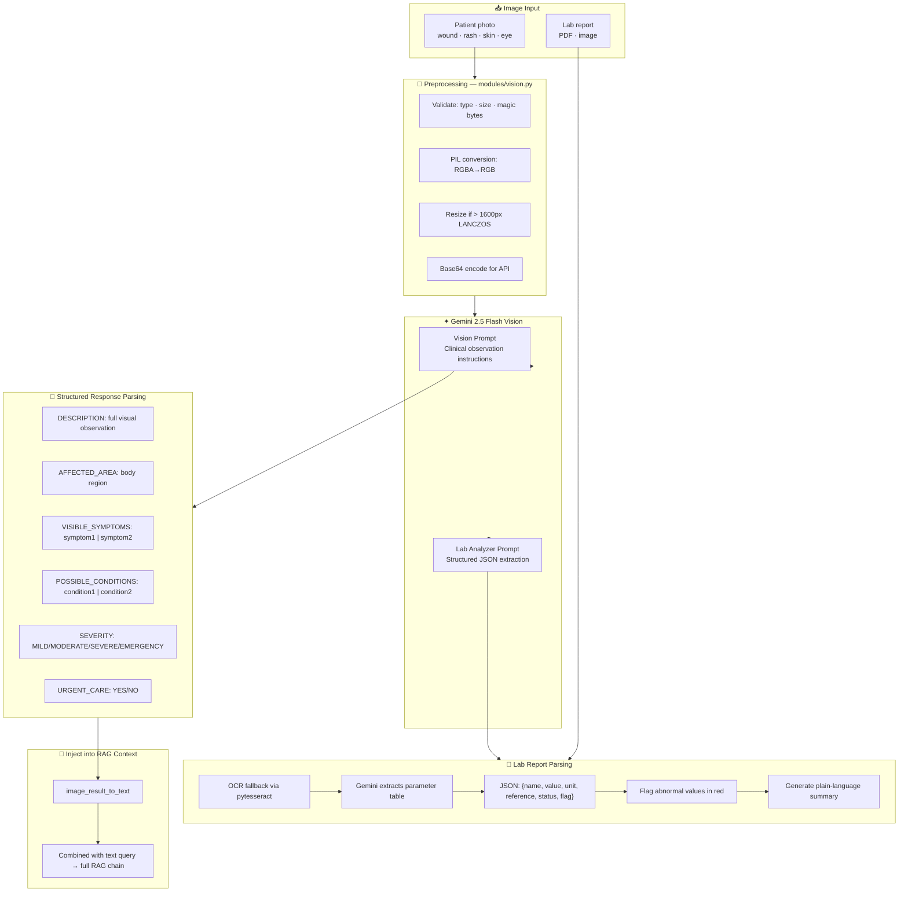

### Clinical Vision Prompt Design

The vision prompt instructs Gemini to respond as a clinical observer — not a diagnostician. It explicitly asks for structured fields that can be parsed deterministically:

```
DESCRIPTION: What do you observe in the image?
AFFECTED_AREA: Which body part or region?
VISIBLE_SYMPTOMS: symptom1 | symptom2 | symptom3
POSSIBLE_CONDITIONS: condition1 | condition2
SEVERITY: MILD/MODERATE/SEVERE/EMERGENCY
RECOMMENDATIONS: Immediate actions
URGENT_CARE: YES/NO
```

This structure ensures the vision output can be parsed into `ImageAnalysisResult` and injected as a text block into the main RAG chain — making the image analysis seamlessly part of the clinical conversation rather than a separate isolated output.

### Lab Report OCR + AI Analysis

For blood reports and scan results:

1. **PDF pages** are rendered to images at 200 DPI using PyMuPDF
2. **pytesseract** extracts raw OCR text as a fallback
3. **Gemini Vision** receives both the image(s) and OCR text, then returns structured JSON:

```json
{
  "report_type": "Complete Blood Count (CBC)",
  "parameters": [
    {"name": "Hemoglobin", "value": "9.2", "unit": "g/dL",
     "reference": "12.0-16.0", "status": "LOW", "flag": true}
  ],
  "abnormal_flags": ["Hemoglobin LOW at 9.2 g/dL (normal: 12-16)"],
  "critical_values": [],
  "summary": "Your hemoglobin is significantly below normal range..."
}
```

Abnormal values are flagged in the UI with red error boxes, and the AI summary is fed into the main consultation as additional clinical context.

> 📸 **Consultation Page:**
> 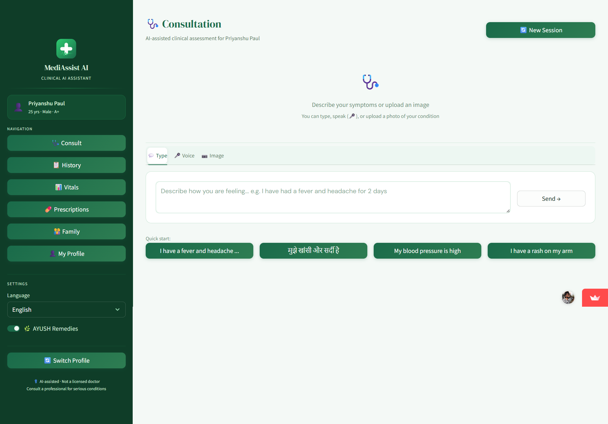


---

## 🎤 Voice Pipeline — Hindi & English

```mermaid
graph LR
    subgraph RECORD["🎤 Audio Capture"]
        MIC[st.audio_input<br/>Browser microphone]
        BYTES[Raw audio bytes<br/>WebM/WAV]
    end

    subgraph SANITIZE_AUD["🛡️ Audio Validation"]
        SZ[Size check < 25MB]
        FMT[Magic byte format detection<br/>WAV · MP3 · WebM · OGG]
    end

    subgraph STT["📝 Speech-to-Text"]
        GCP_CHECK{GCP credentials<br/>available?}
        GCP[Google Cloud Speech-to-Text<br/>en-IN · hi-IN · bn-IN · ta-IN]
        WHISPER[OpenAI Whisper small<br/>Local · Offline fallback]
        CONVERT[pydub WAV conversion<br/>Mono · 16kHz]
    end

    subgraph LANG["🌐 Language Handling"]
        DETECT[detect_language<br/>Devanagari Unicode ratio]
        UPDATE[Update st.session_state.language]
        OVERRIDE[🔴 LANGUAGE OVERRIDE in prompt]
    end

    subgraph TTS["🔊 Text-to-Speech"]
        GTTS[gTTS<br/>English · Hindi · Bengali · Tamil]
        MP3[MP3 audio bytes]
        PLAY[st.audio playback]
    end

    MIC --> BYTES --> SANITIZE_AUD
    SZ --> FMT --> CONVERT
    CONVERT --> GCP_CHECK
    GCP_CHECK -->|Yes| GCP
    GCP_CHECK -->|No| WHISPER
    GCP --> DETECT
    WHISPER --> DETECT
    DETECT --> UPDATE --> OVERRIDE
    OVERRIDE --> RAG_CHAIN[Full RAG Pipeline]
    RAG_CHAIN --> GTTS --> MP3 --> PLAY
```

### Language Switch Behavior

A core design requirement was **instant language switching** — if the patient writes in Hindi, the response must be in Hindi immediately, even if the previous message was in English.

This is solved by two mechanisms working together:

1. **Client-side:** `detect_language()` runs on every user message, updates `st.session_state.language`, and the new value is used for the next API call
2. **Prompt-side:** Every prompt ends with an explicit `🔴 LANGUAGE OVERRIDE` instruction that overrides the conversation history context:

```
🔴 LANGUAGE OVERRIDE — MANDATORY:
The patient's CURRENT message is in Hindi.
You MUST respond ENTIRELY in Hindi only.
Do NOT use English even if previous messages were in English.
```

The `🔴` emoji and caps are intentional — they signal high priority to the model and prevent it from defaulting to the conversation history's dominant language.

---

## 🌿 AYUSH — Ayurvedic Intelligence Module

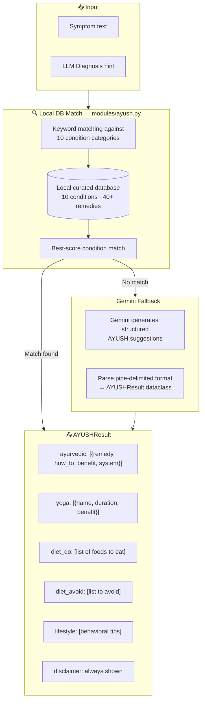

### Local vs. Gemini Fallback Strategy

The AYUSH module uses a **two-tier approach**:

**Tier 1 — Curated local database (instant, no API)**
- 10 condition categories: fever, cold & cough, headache, diabetes, hypertension, indigestion, skin rash, joint pain, anxiety, anaemia
- Each condition has: 3–4 Ayurvedic remedies with preparation instructions, yoga/pranayama recommendations, diet do's and don'ts, and lifestyle tips
- All remedies are traditionally established or clinically studied (e.g., Vijaysar for diabetes, Ashwagandha for anxiety, Shallaki for joint pain)

**Tier 2 — Gemini (for unlisted conditions)**
- Prompts Gemini with a structured pipe-delimited format that can be parsed deterministically
- Falls back gracefully — if Gemini fails, the AYUSH section simply doesn't render

### Why AYUSH Matters for Indian Users

India is unique in that **AYUSH** (Ayurveda, Yoga, Unani, Siddha, Homeopathy) is a Ministry of Health recognized system. For millions of Indian users, Ayurvedic remedies are the first line of treatment. By surfacing these alongside allopathic suggestions — with clear disclaimers — MediAssist AI respects the user's cultural context while maintaining clinical safety.

> 📸 **AYUSH Remedies Suggestions**
> 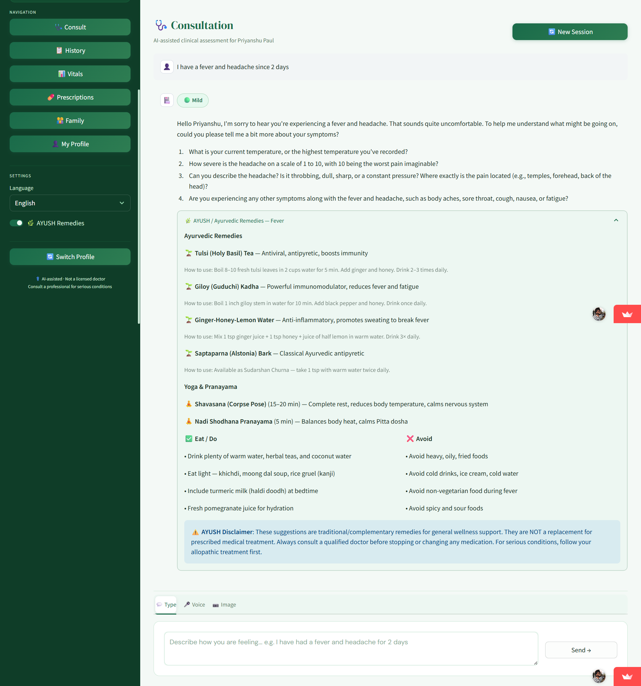

---

## 🔒 Security Architecture

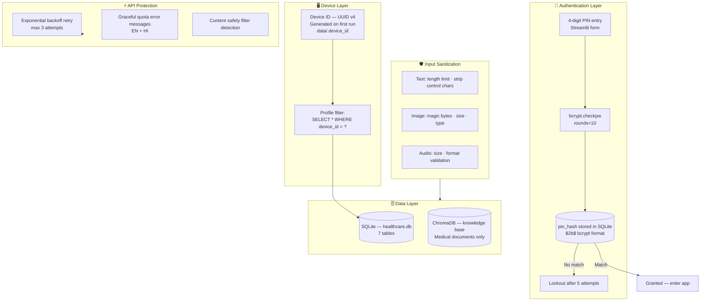

### Device Isolation Guarantee

The device ID (`data/.device_id`) is a UUID v4 stored as a plain text file. It is:
- Generated once on first run of the app on any machine
- Tagged to every patient profile created on that machine
- Used as a `WHERE` filter in every profile query

**Consequence:** If someone copies the `healthcare.db` file to another machine, their device ID won't match any profiles in the copied database — the dropdown shows empty and immediately routes to "New Profile". Medical data remains unreadable even if the database file is extracted.

### PIN Security

Passwords are never stored. Only bcrypt hashes with `rounds=10` are persisted. The PIN verification flow:

```python
bcrypt.checkpw(pin.encode(), stored_hash.encode())  # constant-time comparison
```

Constant-time comparison prevents timing attacks — an attacker cannot determine if they are "getting closer" to the correct PIN by measuring response time.

> 📸 **PIN Based login for security and compliance of medical records**
> 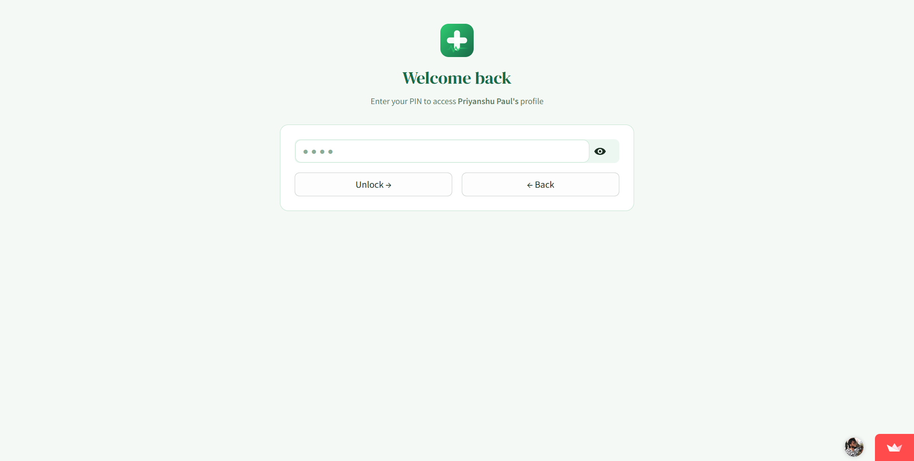

---

## 📁 `core/` — RAG & Intelligence Layer

The `core/` directory is the cognitive backbone of MediAssist AI. Every AI operation — retrieval, generation, memory management, and clinical reasoning — is orchestrated here.

| File | Responsibility |
|---|---|
| `database.py` | SQLite schema, 7-table ORM, all patient data operations |
| `vector_store.py` | ChromaDB wrapper — add, search, filter, get_retriever |
| `ingest.py` | Document ingestion pipeline — load → chunk → embed → store |
| `memory.py` | Session conversation memory + patient context builder |
| `llm_chain.py` | Full RAG chain, Gemini calls, structured response parsing |

---

### `core/database.py`

The persistence layer for all patient data. Uses raw `sqlite3` with a context manager pattern for connection safety.

**Schema — 7 tables:**

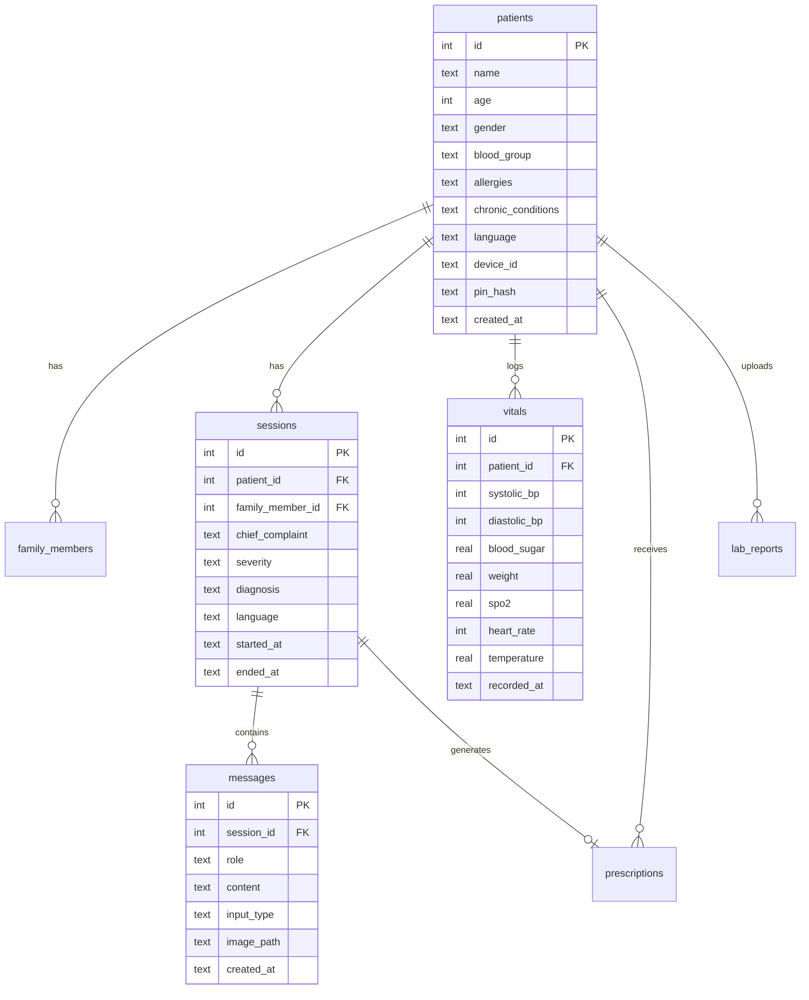

**Key design decisions:**
- `WAL journal mode` for better concurrent read performance when the UI re-renders
- `PRAGMA foreign_keys = ON` enforced on every connection — cascading deletes keep data consistent
- JSON serialisation for list fields (allergies, chronic_conditions) — avoids junction tables for simple lists
- `_migrate()` method uses `try/except` on `ALTER TABLE` to safely add new columns to existing databases — idempotent migrations without a migration framework

---

### `core/vector_store.py`

Thin wrapper around ChromaDB + LangChain's `Chroma` integration.

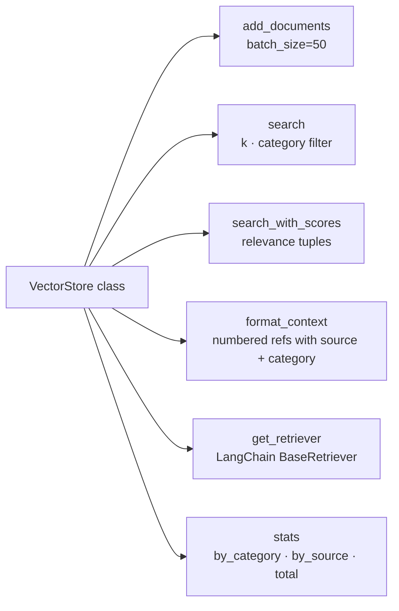

**Category-filtered retrieval** is a key capability — when the query is about a drug interaction, the retriever can restrict to `category="drug"` chunks to improve precision. The `format_context()` method produces a numbered reference block:

```
[Reference 1 | WHO Dengue Fact Sheet | disease | relevance: 0.87]
Dengue fever is a mosquito-borne viral infection...

---

[Reference 2 | MedlinePlus — Fever | symptom | relevance: 0.84]
Fever is a temporary increase in your body temperature...
```

---

### `core/ingest.py`

The one-time pipeline that builds the knowledge base from raw documents.

```mermaid
flowchart LR
    subgraph LOADERS["📄 Loaders"]
        PDF[load_pdf<br/>PyMuPDF — page by page]
        TXT[load_txt<br/>plain text]
        XML[load_medlineplus_xml<br/>health-topic elements]
    end

    subgraph PROCESS["⚙️ Processing"]
        CHUNK[RecursiveCharacterTextSplitter<br/>size=800 · overlap=100<br/>separators: paragraph→line→sentence→word]
        CAT[detect_category<br/>keyword frequency scoring]
    end

    subgraph TRACK["📊 Tracking"]
        HASH[MD5 file hash]
        TRACKER[(ingest_tracker.db<br/>indexed_files table)]
        SKIP[Skip already-indexed files]
    end

    subgraph STORE["💾 Storage"]
        EMBED[HuggingFace Embeddings]
        CHROMA[(ChromaDB)]
    end

    LOADERS --> PROCESS --> TRACK
    HASH --> TRACKER
    TRACKER --> SKIP
    SKIP -->|New file| EMBED --> CHROMA
```

**Idempotency via MD5 tracking:** Each file's MD5 hash is stored in a separate `ingest_tracker.db`. Re-running `python -m core.ingest` skips files already indexed, making the pipeline safe to run repeatedly. `--force` flag bypasses this check.

**Category auto-detection** scores each chunk against keyword lists for 5 categories (disease, drug, symptom, nutrition, mental) and assigns the highest-scoring category as metadata. This enables category-filtered retrieval at query time.

---

### `core/memory.py`

Two classes handle context management:

**`SessionMemory`** — manages the active conversation turn by turn:
- Stores `ChatMessage` objects in memory during a session
- Persists each turn to SQLite via `db.add_message()` immediately
- Converts history to LangChain `HumanMessage` / `AIMessage` objects for the Gemini API
- Truncates to `MAX_HISTORY_TURNS=20` to prevent context window overflow
- Exposes `turn_count()` which drives the auto-prescription threshold

**`PatientContextBuilder`** — assembles the patient's medical chart as a string:
```
[Patient Profile]
Name       : Priya Sharma
Age/Gender : 26 / Female
Blood Group: B+
Allergies  : penicillin
Chronic Conditions: None

Recent Vitals (2026-05-28): BP: 120/80 mmHg | SpO₂: 98.0% | Heart Rate: 72 bpm

Past Consultation History:
[Session 2026-05-20] Complaint: Fever | Diagnosis: Viral fever
  PATIENT: I have a fever of 102°F since 2 days
  ASSISTANT: Since how many days are you experiencing...
```

This full context is injected into every prompt — Gemini never starts a conversation without knowing who the patient is.

---

### `core/llm_chain.py`

The clinical reasoning engine. The `MedicalChain` class orchestrates the full RAG pipeline.

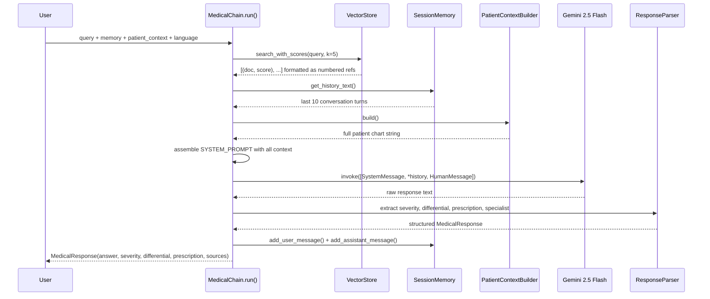

**`MedicalResponse` dataclass** carries all structured fields:

```python
@dataclass
class MedicalResponse:
    answer: str                     # clean display text
    severity: str                   # mild | moderate | severe | emergency
    differential: list[dict]        # [{condition, likelihood, reason}]
    prescription: Optional[dict]    # {diagnosis, medications, advice, follow_up}
    sources: list[str]              # source document names
    language: str                   # en | hi
    needs_specialist: Optional[str] # "Cardiologist" etc.
    emergency_alert: bool           # True if severity == emergency
```

**Rate limiting with exponential backoff** — `_call_llm_with_retry()` handles quota errors (429), timeouts, authentication errors, and content safety blocks with user-friendly messages in both English and Hindi.

---

## 📁 `modules/` — Specialised AI Modules

Each module in `modules/` is a self-contained AI capability that plugs into the main pipeline.

| Module | Capability | API dependency |
|---|---|---|
| `vision.py` | Image analysis + lab report OCR | Gemini Vision |
| `voice.py` | STT (Hindi/English) + TTS | GCP Speech / Whisper + gTTS |
| `triage.py` | Severity classification | Rule-based (no API) |
| `drug_checker.py` | Drug interaction + allergy check | Local DB + OpenFDA API |
| `ayush.py` | Ayurvedic remedies engine | Local DB + Gemini fallback |

---

### `modules/triage.py`

Two-tier triage — fast rule-based first, LLM-parsed result second.

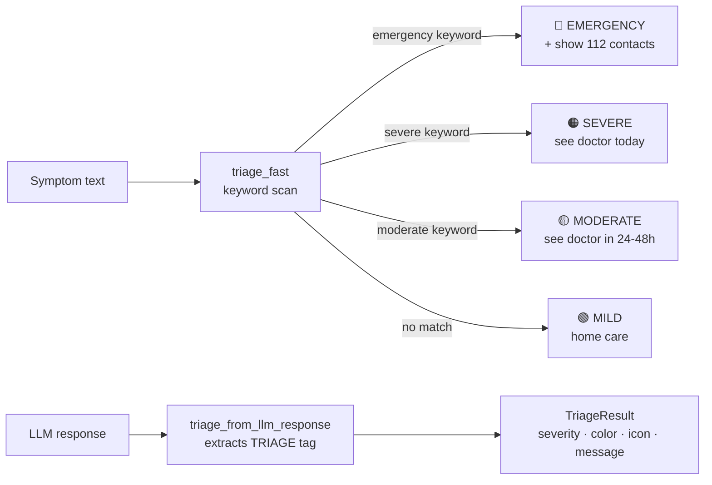

The fast triage runs **before** the LLM call and displays an immediate badge in the UI — giving the user triage feedback in milliseconds while the full RAG chain processes. Emergency keyword detection includes 40+ patterns covering cardiac, neurological, respiratory, bleeding, and consciousness events.

---

### `modules/drug_checker.py`

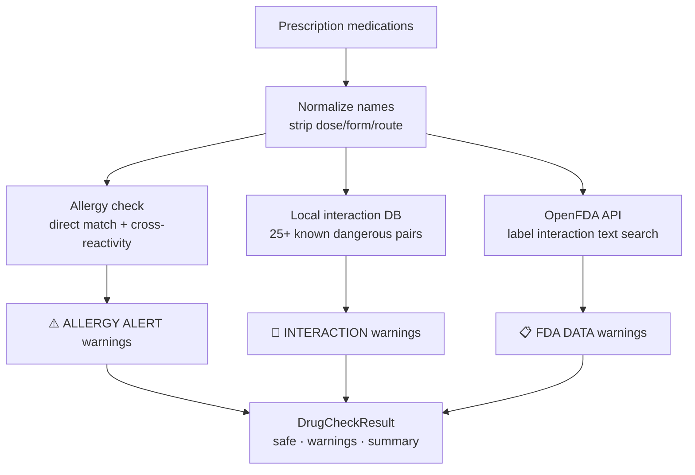

**Cross-reactivity database** catches indirect allergies — if a patient is allergic to penicillin, the checker flags amoxicillin, ampicillin, co-amoxiclav, and all other β-lactam antibiotics as high-severity conflicts. This prevents a common real-world prescription error.

**Curated interaction pairs** include clinically significant combinations: Warfarin + Aspirin (bleeding), Tramadol + SSRIs (serotonin syndrome), Statins + Clarithromycin (myopathy), Digoxin + Amiodarone (toxicity), and 20+ others.

---

## 📁 `ui/` — Streamlit Interface Layer

| File | Page | Key features |
|---|---|---|
| `chat_ui.py` | Consult | Chat · Voice · Image · Triage · Differential · AYUSH · Prescription |
| `history_ui.py` | History | Session browser · search · severity filter · message transcript |
| `vitals_ui.py` | Vitals | Log form · trend line charts for 6 metrics |
| `prescriptions_ui.py` | Prescriptions | Prescription list · PDF re-download for any past prescription |
| `family_ui.py` | Family | Add/manage family members · one-click consult switch |
| `profile_ui.py` | My Profile | View + edit profile · health stats dashboard |

### `ui/chat_ui.py` — The Consultation Interface

The most complex UI module — handles three distinct input modes in a tabbed interface:

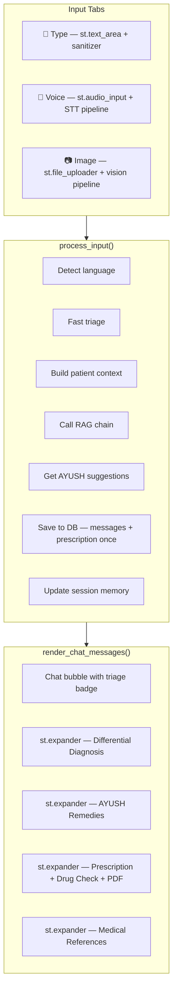

**Critical design:** `db.save_prescription()` is called exactly **once** inside `process_input()` — never inside `render_chat_messages()`. Since `render_chat_messages()` runs on every Streamlit rerender, placing DB writes there would create duplicate prescriptions on every UI interaction.

---

## 📁 `utils/` — Utilities & Generators

| File | Purpose |
|---|---|
| `pdf_generator.py` | ReportLab prescription PDF engine |
| `security.py` | Device ID generation, bcrypt PIN hashing |


### `utils/pdf_generator.py`

Generates clinic-quality prescription PDFs using ReportLab's Platypus layout engine.

> 📸 **Prescritpion of a patient(Generated by Agent)**
> 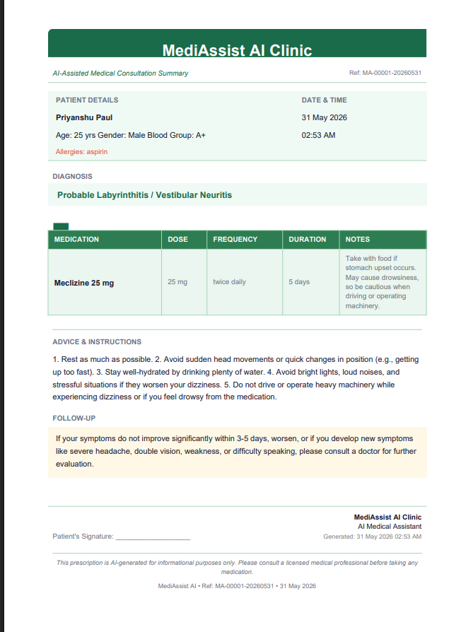

The PDF is returned as `bytes` — never written to disk during generation. `st.download_button(data=pdf_bytes)` streams it directly to the user's browser.

---

## 📁 `data/` — Persistence Layer

```
data/
├── healthcare.db        # SQLite — all patient data (7 tables)
├── ingest_tracker.db    # MD5 hashes of indexed documents
├── chroma_db/           # ChromaDB persistent vector store (9,677 chunks)
├── medical_kb/          # Source medical documents (25 files)
│   ├── who_diabetes.txt
│   ├── who_hypertension.txt
│   ├── who_dengue.txt
│   └── medlineplus_health_topics.xml  (15MB — 2,033 topics)
└── .device_id           # UUID v4 — machine identifier (never commit)
```

**Why SQLite + ChromaDB (not one DB for everything)?**

| Concern | SQLite | ChromaDB |
|---|---|---|
| Patient profiles, vitals, sessions | ✅ Relational, ACID, JOINs | ❌ Not designed for structured records |
| Medical knowledge retrieval | ❌ No semantic search | ✅ Vector similarity, metadata filters |
| Prescription storage | ✅ Structured, queryable | ❌ Overkill |
| KB chunk retrieval | ❌ Would require LIKE %% | ✅ Sub-second cosine similarity |

Each database does exactly what it's best at. They never overlap.

---

## 📚 Knowledge Base — Medical Corpus

| Source | Format | Content | Chunks |
|---|---|---|---|
| WHO Fact Sheets (25 files) | TXT (scraped) | Diabetes, Hypertension, Dengue, TB, Malaria, Asthma, Cancer, Depression, Anaemia, Cholera, Typhoid, Hepatitis B/C, HIV, Pneumonia, Diarrhoea, Obesity, CVD, Epilepsy, Influenza, Blindness, Deafness, Chronic Kidney, Mental Health, Stroke | 359 |
| MedlinePlus Health Topics | XML (bulk) | 2,033 health topics in structured XML | 9,318 |
| **Total** | | **2,058 source documents** | **9,677** |

**Category distribution after auto-tagging:**

```
general  : 4,354 chunks (45%)  — cross-category topics
disease  : 2,614 chunks (27%)  — specific conditions
symptom  : 1,084 chunks (11%)  — symptom descriptions
nutrition:   670 chunks  (7%)  — dietary information
drug     :   509 chunks  (5%)  — medication information
mental   :   446 chunks  (5%)  — mental health content
```

---

## 🚀 Getting Started

### Prerequisites

- Python 3.12+
- [Tesseract OCR](https://github.com/UB-Mannheim/tesseract/wiki) — for lab report OCR
- [FFmpeg](https://ffmpeg.org/download.html) — for audio format conversion
- Google Gemini API key — [Get free at aistudio.google.com](https://aistudio.google.com/app/apikey)
- Google Cloud service account (optional) — for premium Hindi STT

### Installation

```bash
# 1. Clone the repository
git clone https://github.com/yourusername/mediassist-ai.git
cd mediassist-ai

# 2. Create and activate virtual environment
python -m venv venv

# Windows
venv\Scripts\activate

# macOS/Linux
source venv/bin/activate

# 3. Install dependencies
pip install -r requirements.txt

# 4. Additional packages
pip install langchain-chroma langchain-huggingface langdetect pydub
```

### Environment Setup

Create a `.env` file in the project root:

```env
# ── Required ──────────────────────────────────────────────
GEMINI_API_KEY=your_gemini_api_key_here

# ── Optional — Google Cloud STT (Hindi premium) ───────────
GOOGLE_APPLICATION_CREDENTIALS=path/to/service_account.json

# ── Model settings (defaults shown) ──────────────────────
GEMINI_MODEL=gemini-1.5-pro
GEMINI_TEMPERATURE=0.3
GEMINI_MAX_TOKENS=2048
RETRIEVER_TOP_K=5
CHUNK_SIZE=800
CHUNK_OVERLAP=100

# ── Paths (auto-created if missing) ──────────────────────
SQLITE_DB_PATH=data/healthcare.db
CHROMA_DB_PATH=data/chroma_db
MEDICAL_KB_PATH=data/medical_kb
```

### Build the Knowledge Base

```bash
# Step 1 — Download medical documents
pip install beautifulsoup4
python download_kb.py
# Downloads 25 WHO fact sheets + MedlinePlus XML (~15MB total)

# Step 2 — Ingest into ChromaDB (one-time, ~5 minutes)
python -m core.ingest
# Embeds 9,677 chunks — subsequent runs skip already-indexed files

# Step 3 — Verify
python -m core.vector_store
# Should show: ✅ 9,677 total chunks across 6 categories
```

### Run the Application

```bash
streamlit run app.py
```

Visit `http://localhost:8501`. On first launch, you will be prompted to create a profile and set a 4-digit PIN.

### Project Structure

```
mediassist-ai/
├── app.py                    # Main Streamlit app + landing page + auth flow
├── config.py                 # Centralised config — reads .env + st.secrets
├── download_kb.py            # One-time KB download script
├── requirements.txt
├── Dockerfile
├── .env                      # Never commit — local API keys
├── .gitignore
│
├── core/
│   ├── database.py           # SQLite ORM — 7 tables + migrations
│   ├── vector_store.py       # ChromaDB wrapper + retriever factory
│   ├── ingest.py             # Document ingestion pipeline
│   ├── memory.py             # Session memory + patient context builder
│   └── llm_chain.py          # Full RAG chain + Gemini + response parser
│
├── modules/
│   ├── vision.py             # Gemini Vision + lab report OCR
│   ├── voice.py              # STT (GCP/Whisper) + TTS (gTTS)
│   ├── triage.py             # Severity classifier + emergency alerts
│   ├── drug_checker.py       # Drug interaction + allergy validation
│   └── ayush.py              # Ayurvedic remedies engine
│
├── ui/
│   ├── chat_ui.py            # Main consultation interface
│   ├── history_ui.py         # Past session browser
│   ├── vitals_ui.py          # Vitals logger + trend charts
│   ├── prescriptions_ui.py   # Prescription list + download
│   ├── family_ui.py          # Family profile management
│   └── profile_ui.py         # Patient profile view/edit
│
├── utils/
│   ├── pdf_generator.py      # ReportLab prescription PDF engine
│   ├── security.py           # Device ID + bcrypt PIN hashing
│  
│
├── data/
│   ├── chroma_db/            # Vector embeddings (auto-created)
│   ├── medical_kb/           # Source documents (auto-populated)
│   ├── healthcare.db         # Patient SQLite database (auto-created)
│   └── .device_id            # Machine UUID (auto-created, never commit)
│
├── assets/
│   └── doctor-ai.png         # Landing page illustration
│
└── .streamlit/
    ├── config.toml           # Theme + server config
    └── secrets.toml.example  # Template for Streamlit Cloud secrets
```

---

## 🌐 Environment Variables

| Variable | Default | Description |
|---|---|---|
| `GEMINI_API_KEY` | ***Your API_KEY*** | Google Gemini API key |
| `GOOGLE_APPLICATION_CREDENTIALS` | optional | Path to GCP service account JSON for Cloud STT |
| `GEMINI_MODEL` | `gemini-2.5-Flash` | Gemini model name |
| `GEMINI_TEMPERATURE` | `0.3` | LLM temperature (0=deterministic, 1=creative) |
| `GEMINI_MAX_TOKENS` | `2048` | Max output tokens per response |
| `RETRIEVER_TOP_K` | `5` | Number of KB chunks retrieved per query |
| `CHUNK_SIZE` | `800` | Document chunk size for ingestion |
| `CHUNK_OVERLAP` | `100` | Chunk overlap to prevent boundary loss |
| `EMBEDDING_MODEL` | `paraphrase-multilingual-MiniLM-L12-v2` | HuggingFace embedding model |
| `SQLITE_DB_PATH` | `data/healthcare.db` | Patient database path |
| `CHROMA_DB_PATH` | `data/chroma_db` | Vector store path |
| `MEDICAL_KB_PATH` | `data/medical_kb` | Medical document directory |
---

## 🚢 Deployment

### Option A — Streamlit Community Cloud (Demo)

> ⚠️ Streamlit Cloud uses an ephemeral filesystem — patient data and ChromaDB do not persist across restarts. Suitable for demos only.

1. Push code to GitHub (`.env`, `data/`, `assets/` excluded by `.gitignore`)
2. Visit [share.streamlit.io](https://share.streamlit.io) → **New app** → select repo → `app.py`
3. **Advanced settings → Secrets** → paste:
   ```toml
   GEMINI_API_KEY = "your_key_here"
   ```
4. Deploy — on first boot, run the ingestion pipeline via the terminal tab

### Option B — VPS with Docker (Production)

```bash
# On your VPS (DigitalOcean, AWS EC2, etc.)

# 1. Install Docker
curl -fsSL https://get.docker.com | sh

# 2. Clone repo
git clone https://github.com/yourusername/mediassist-ai.git
cd mediassist-ai

# 3. Create .env
echo "GEMINI_API_KEY=your_key_here" > .env

# 4. Build image
docker build -t mediassist .

# 5. Run ingestion once (builds KB on server)
docker run --rm \
  -v $(pwd)/data:/app/data \
  --env-file .env \
  mediassist python -m core.ingest

# 6. Start app with persistent volume
docker run -d \
  --name mediassist \
  -p 8501:8501 \
  -v $(pwd)/data:/app/data \
  -v $(pwd)/assets:/app/assets \
  --env-file .env \
  --restart unless-stopped \
  mediassist
```

Access at `http://your-server-ip:8501`. For HTTPS, place Nginx in front with Let's Encrypt SSL.

---

## 🛠️ Tech Stack

| Component | Technology | Purpose |
|---|---|---|
| UI Framework | Streamlit 1.57+ | Web interface + custom CSS design system |
| Primary LLM | Gemini 2.5 Flash | Text RAG, Vision analysis, Prescription generation |
| LLM Framework | LangChain + LCEL | RAG chain composition |
| Vector Store | ChromaDB | Persistent semantic similarity search |
| Embeddings | paraphrase-multilingual-MiniLM-L12-v2 | Multilingual (EN + HI + 50 langs) local embeddings |
| OCR | pytesseract + PyMuPDF | Lab report text extraction |
| Vision | Gemini 2.5 Flash Vision | Wound/rash/skin image analysis |
| English STT | OpenAI Whisper small | Local offline speech-to-text |
| Hindi STT | Google Cloud Speech-to-Text | hi-IN premium transcription |
| TTS | gTTS | Hindi + English audio response |
| PDF Engine | ReportLab (Platypus) | Clinic-quality prescription PDF generation |
| Database | SQLite 3 | Patient profiles, sessions, vitals, prescriptions |
| Security | bcrypt + UUID v4 | PIN hashing + device isolation |
| Document Processing | LangChain text splitters | Chunking for ingestion |
| Audio Processing | pydub | Format conversion for voice input |
| Drug Checking | Local DB + OpenFDA API | Interaction and allergy validation |
| AYUSH | Local KB + Gemini fallback | Ayurvedic remedies engine |

---

## 👨‍💻 Developer

<div align="center">

**Priyanshu Paul**

*Building AI systems with clinical intent and engineering precision*

[](https://github.com/priyanshu09102003)
[](https://www.linkedin.com/in/priyanshu-paul-59221228a/)

</div>

---

<div align="center">

**MediAssist AI** — Grounded in evidence. Built for Wellness.

⭐ Star this repository if you found it useful.

*This system is AI-assisted and an idea/prototype - not an utimate substitute for professional medical advice. Always consult a licensed physician for diagnosis and treatment.*

</div>