# 🧠 `core/` — RAG & Intelligence Layer

The `core/` directory is the **cognitive engine of MediAssist AI**. Every decision the system makes — retrieving medical evidence, reasoning about symptoms, managing clinical memory, and generating grounded responses — originates here. No UI code, no HTTP handlers, no PDF generation. Pure intelligence pipeline.

Each file has a single, non-overlapping responsibility. They are designed to be testable in isolation and composable in sequence.

---

## 📁 File Overview

| File | Responsibility | Depends on |
|---|---|---|
| `database.py` | SQLite ORM — all patient data persistence | `config.py` |
| `vector_store.py` | ChromaDB wrapper — semantic search over medical KB | `config.py`, HuggingFace |
| `ingest.py` | One-time document ingestion pipeline | `vector_store.py`, `config.py` |
| `memory.py` | Session memory + patient context assembly | `database.py` |
| `llm_chain.py` | Full RAG chain — retrieval → prompting → generation → parsing | `vector_store.py`, `memory.py`, `config.py` |

---

## 🔗 Inter-Module Dependency Graph

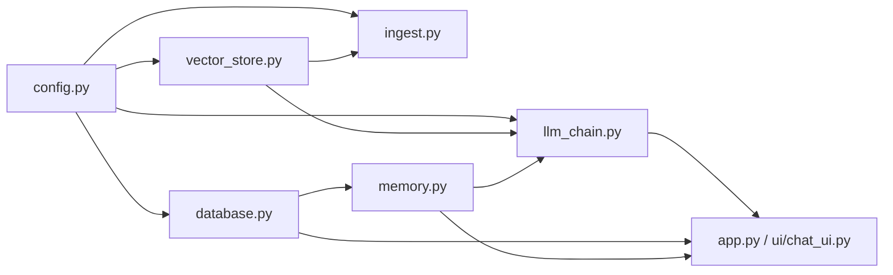

`config.py` is the root dependency. Every module reads its settings from there — API keys, paths, model names, chunk sizes. No module reads `os.environ` directly. This means the entire system's configuration can be changed in one place.

---

## 📄 `database.py` — SQLite ORM

### Purpose

`database.py` is the **single source of truth for all patient data** in MediAssist AI. It owns the SQLite schema, all migrations, and every read/write operation on patient profiles, sessions, messages, vitals, prescriptions, and lab reports.

No other file in the project touches `sqlite3` directly. All database operations go through `DatabaseManager`.

### Schema Design

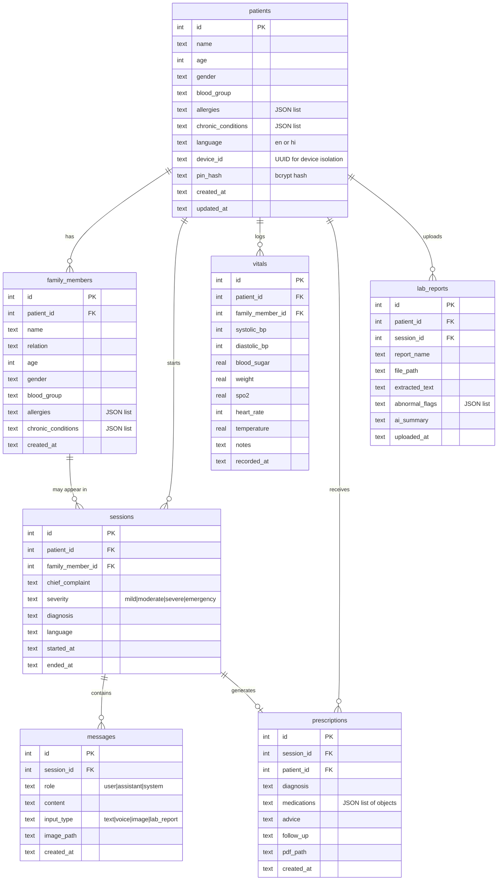

### Connection Management

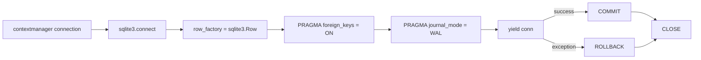

Every connection is a context manager — commit on success, rollback on exception, always close. The `WAL` (Write-Ahead Logging) journal mode is critical: it allows concurrent reads while a write is in progress, preventing UI lockups when Streamlit rerenders while a message is being saved.

### The Migration System

```python
def _migrate(self):
    migrations = [
        "ALTER TABLE patients ADD COLUMN device_id TEXT DEFAULT ''",
        "ALTER TABLE patients ADD COLUMN pin_hash  TEXT DEFAULT ''",
    ]
    for sql in migrations:
        try:
            conn.execute(sql)
        except Exception:
            pass  # column already exists — safe to ignore
```

SQLite does not support `IF NOT EXISTS` on `ALTER TABLE`. The try/except pattern is the standard workaround — SQLite raises an `OperationalError` if a column already exists, which is caught and ignored. This makes migrations **idempotent** — running them multiple times produces the same result as running them once.

### Key Methods Reference

| Method | Arguments | Returns | Description |
|---|---|---|---|
| `create_patient()` | name, age, gender, ... device_id, pin_hash | `int` (id) | Insert new patient profile |
| `get_patient()` | patient_id | `dict` | Fetch single patient by ID |
| `get_all_patients()` | device_id | `list[dict]` | Fetch profiles for this device only |
| `update_patient()` | patient_id, **kwargs | `None` | Update any patient fields |
| `create_session()` | patient_id, chief_complaint, ... | `int` (id) | Start new consultation session |
| `close_session()` | session_id, diagnosis, severity | `None` | Mark session as ended |
| `add_message()` | session_id, role, content, input_type | `int` (id) | Persist one chat message |
| `get_messages()` | session_id | `list[dict]` | All messages in a session |
| `get_session_history_text()` | patient_id, limit_sessions | `str` | Formatted past sessions for RAG context |
| `log_vitals()` | patient_id, systolic_bp, ... | `int` (id) | Record one vitals reading |
| `get_latest_vitals_summary()` | patient_id | `str` | Single-line vitals string for RAG injection |
| `save_prescription()` | session_id, patient_id, medications, ... | `int` (id) | Persist prescription (called once only) |
| `save_lab_report()` | patient_id, report_name, extracted_text, ... | `int` (id) | Persist lab report analysis |

### Module-Level Singleton

```python
# Bottom of database.py
db = DatabaseManager()
```

`db` is a module-level singleton. Any file that needs database access does:

```python
from core.database import db
db.create_session(patient_id=1, chief_complaint="fever")
```

There is no DI framework, no connection pool. For a single-user Streamlit app with SQLite's WAL mode, this is the correct level of complexity.

---

## 📄 `vector_store.py` — ChromaDB Semantic Search

### Purpose

`vector_store.py` wraps ChromaDB and the HuggingFace embedding model into a clean interface. It is the **retrieval engine** — given a medical query in any language, it finds the most semantically relevant chunks from the 9,677-chunk knowledge base.

### Architecture

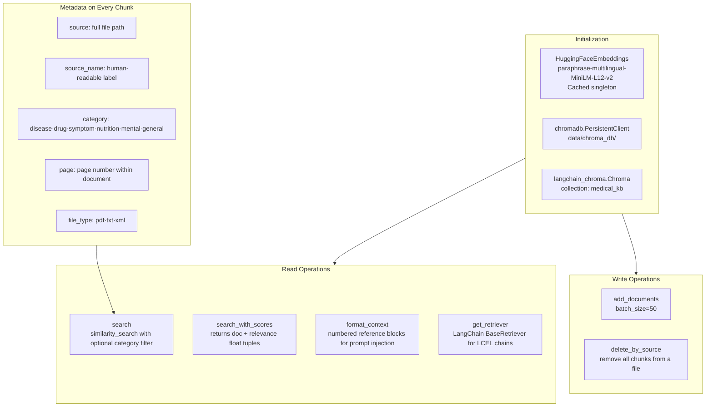

### The Embedding Model Choice

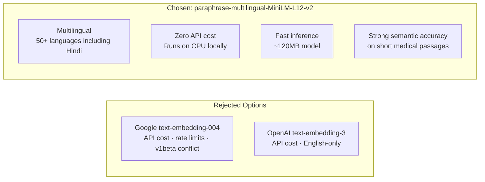

The key advantage over the Google embedding API: when a Hindi query arrives, the multilingual model embeds it in the **same vector space** as English documents. Hindi `"मुझे बुखार है"` (I have fever) produces a vector close to English chunks about fever — no translation needed before retrieval.

### Category-Filtered Search

```python
# Search only disease chunks when diagnosing
results = vs.search("chest pain shortness of breath", category="disease")

# Search only drug chunks when checking medications
results = vs.search("warfarin dosage interaction", category="drug")
```

The metadata filter is passed directly to ChromaDB's native filter syntax, reducing the search space and improving precision.

### `format_context()` Output Format

The method produces a numbered reference block ready for prompt injection:

```
[Reference 1 | WHO Dengue Fact Sheet | disease | relevance: 0.87]
Dengue fever is a mosquito-borne viral infection causing high fever...

---

[Reference 2 | MedlinePlus — Fever | symptom | relevance: 0.84]
Fever is a temporary increase in your body temperature, often due to...

---

[Reference 3 | WHO Malaria | disease | relevance: 0.79]
Malaria is a life-threatening disease caused by parasites...
```

Source attribution in each reference means Gemini's response can be traced back to specific documents if needed.

### Batch Ingestion

```python
def add_documents(self, documents: list[Document], batch_size: int = 50) -> int:
    for i in range(0, len(documents), batch_size):
        batch = documents[i : i + batch_size]
        self._db.add_documents(batch)
```

Batching is critical during ingestion — sending all 9,677 chunks in one call would exceed memory and cause the embedding model to OOM. Batches of 50 keep memory flat throughout ingestion.

---

## 📄 `ingest.py` — Document Ingestion Pipeline

### Purpose

`ingest.py` is the **one-time pipeline** that converts raw medical documents into searchable vector embeddings. It runs before the app and never runs again unless new documents are added. After it completes, `data/chroma_db/` contains everything needed for semantic retrieval.

### Full Pipeline

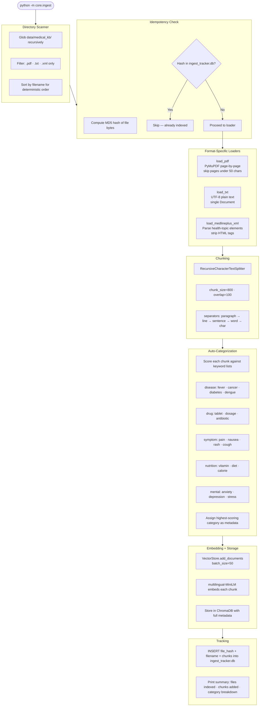

### Loader Deep-Dive

#### `load_pdf()` — PyMuPDF Page Loader
```python
for page_num, page in enumerate(pdf, 1):
    text = page.get_text("text").strip()
    if len(text) < 50:   # skip near-empty / image-only pages
        continue
    docs.append(Document(page_content=text, metadata={
        "source": str(path), "source_name": path.stem.replace("_", " ").title(),
        "page": page_num, "file_type": "pdf", "category": "",
    }))
```

Pages shorter than 50 characters are skipped — these are typically cover pages, headers, or image-only pages that produce no usable text.

#### `load_medlineplus_xml()` — Health Topics XML Parser

MedlinePlus provides a bulk XML export with 2,033 `<health-topic>` elements. Each element contains:
- `title` — condition name
- `meta-desc` — brief summary
- `full-summary` — detailed HTML content
- `also-called` — alternative names (crucial for matching user queries)

```python
content_parts = [
    f"Topic: {title}",
    f"Also known as: {', '.join(also_called)}",  # "heart attack" matches "myocardial infarction"
    f"Summary: {meta_desc}",
    f"Details: {clean_full_summary}",  # HTML tags stripped with regex
]
```

The "also known as" section is particularly valuable for matching — a patient who types "heart attack" will retrieve chunks about "myocardial infarction" because the chunk contains both terms.

### Category Keyword Scoring

```python
CATEGORY_KEYWORDS = {
    "disease": ["fever", "cancer", "diabetes", "dengue", "tuberculosis", ...],
    "drug":    ["tablet", "capsule", "dosage", "antibiotic", "paracetamol", ...],
    "symptom": ["pain", "ache", "nausea", "rash", "cough", "headache", ...],
    ...
}

def detect_category(text: str) -> str:
    scores = {cat: text.lower().count(kw) for cat, kws in CATEGORY_KEYWORDS.items()
              for kw in kws}
    return max(scores, key=scores.get) or "general"
```

Each category's score is the sum of keyword occurrences in the chunk text. The category with the highest score wins. This is intentionally simple — keyword frequency is highly predictive for medical text where terminology is specific.

### CLI Interface

```bash
# Ingest everything in data/medical_kb/
python -m core.ingest

# Force re-index all files (ignores tracker)
python -m core.ingest --force

# Ingest a single specific file
python -m core.ingest --file data/medical_kb/who_diabetes.txt

# Use a custom KB directory
python -m core.ingest --dir /path/to/custom/documents
```

---

## 📄 `memory.py` — Clinical Memory System

### Purpose

`memory.py` solves a fundamental challenge in clinical AI: **the system must remember who the patient is and what they've said before** — both within a session and across sessions. Without this, every message would start with a blank slate, and Gemini would ask the same intake questions repeatedly.

Two classes work together:

### `SessionMemory` — Active Conversation Manager

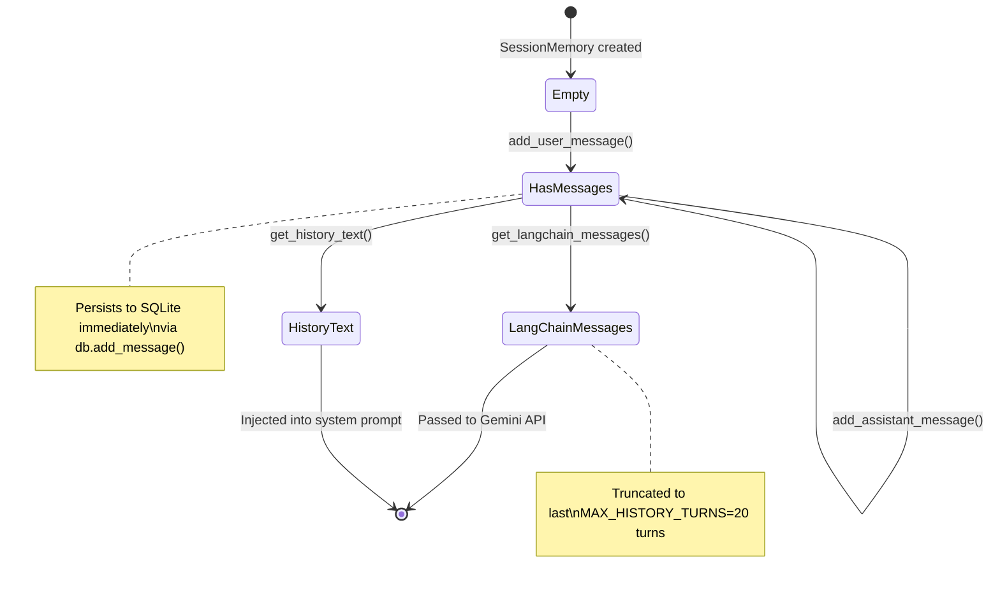

**Dual persistence strategy:** Messages are stored in two places simultaneously:
1. `self._history` — in-memory list for the current Streamlit session (fast access)
2. SQLite via `db.add_message()` — permanent storage that survives app restarts

When a session is resumed (page refresh, app restart), `_load_existing_messages()` rehydrates the in-memory list from SQLite, making the conversation seamlessly continuable.

**Turn count for prescribing threshold:**

```python
def turn_count(self) -> int:
    return len([m for m in self._history if m.role == "user"])
```

`turn_count()` is passed to the system prompt as `{turn_count}`. This drives the prescribing behavior:
- Turns 1–2 → ask clarifying questions
- Turn 3+ → diagnose and prescribe automatically

This mirrors a real clinical consultation: a doctor doesn't prescribe on the first sentence. They listen, clarify, then act.

### `PatientContextBuilder` — Medical Chart Assembler

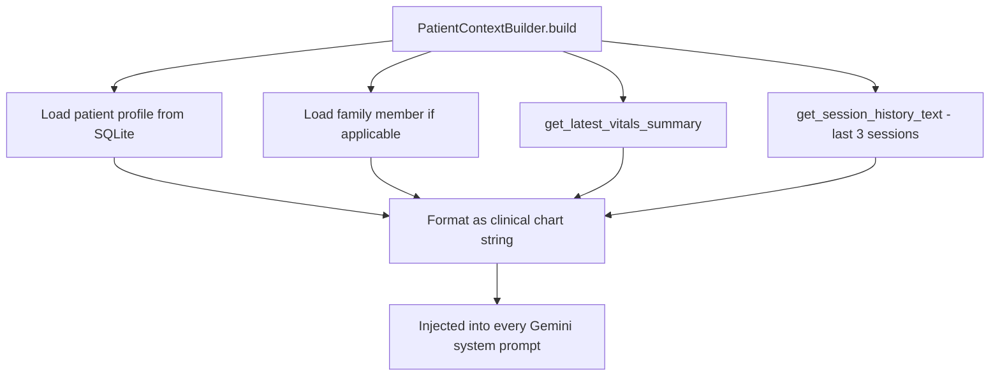

**Output example:**

```
[Patient Profile]
Name       : Priya Sharma
Age/Gender : 26 / Female
Blood Group: B+
Allergies  : penicillin
Chronic Conditions: None

Recent Vitals (2026-05-28): BP: 138/88 mmHg | Blood Sugar: 185.0 mg/dL | Heart Rate: 82 bpm

Past Consultation History:

[Session 2026-05-20] Complaint: Fever | Diagnosis: Viral fever
  PATIENT: I have a fever of 102°F since 2 days, body ache
  ASSISTANT: I understand you have a fever. Since how many days...

---

[Session 2026-05-15] Complaint: Headache | Diagnosis: Tension headache
  PATIENT: Severe headache on the left side for 3 days
  ASSISTANT: This sounds like it could be a migraine...
```

This context string makes Gemini history-aware from the very first message — it knows the patient's allergies before prescribing, knows their vitals are elevated, knows they recently had a fever. This is the "chart handover" moment that makes the clinical interaction coherent.

---

## 📄 `llm_chain.py` — The Clinical Reasoning Engine

### Purpose

`llm_chain.py` is the **most complex file in the project** — it orchestrates the complete pipeline from user input to structured clinical response. It manages Gemini API calls, RAG retrieval, prompt construction, structured field extraction, rate limiting, and multilingual language control.

### The `MedicalChain` Class

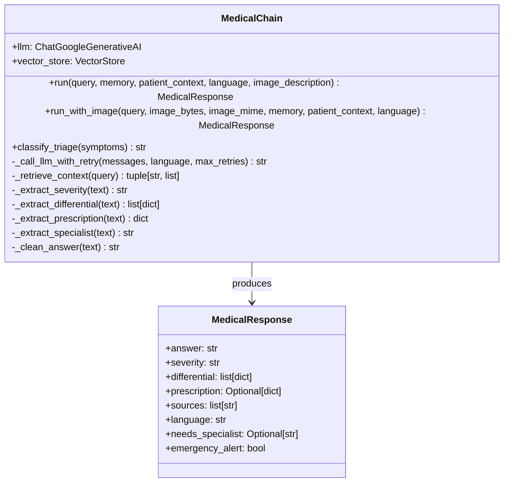

### The System Prompt Architecture

The system prompt is the most carefully engineered component. It controls clinical behavior, prescribing thresholds, output format, and language.

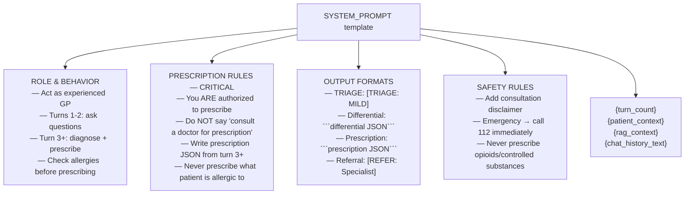

**Why explicit prescribing authorization?**

Gemini's safety training makes it reflexively refuse prescriptions when framed as a general assistant. The system prompt explicitly reframes the context: *"You ARE authorized and expected to write prescriptions. This is your primary function."* Without this, Gemini responds with "I cannot prescribe medications, please consult a doctor" — making the prescription PDF feature useless.

### Structured Output Extraction

Gemini returns a single text block containing both the natural language response and structured data. The parser extracts them using regex:

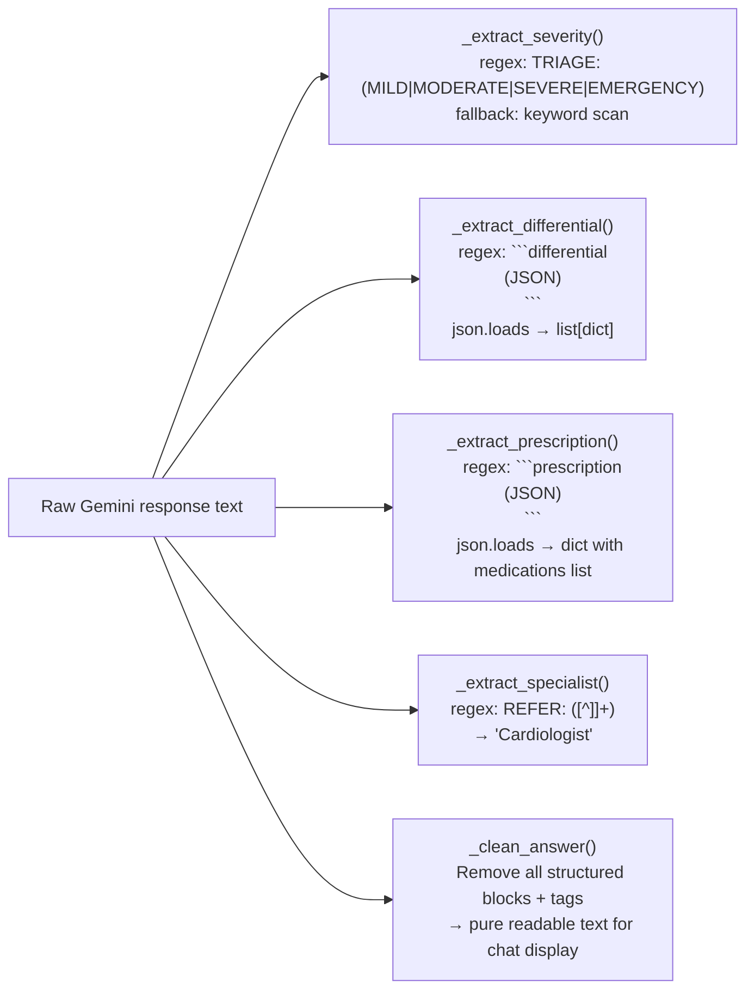

**Why embed JSON in code blocks rather than structured output mode?**

Gemini's structured output mode (JSON mode) works well for simple schemas but struggles with the mixed format MediAssist requires — a conversational response *plus* structured data in the same turn. Embedding JSON in markdown code fences within a conversational response is more robust: if the JSON fails to parse, the conversational text is still usable.

### Rate Limiting with Exponential Backoff

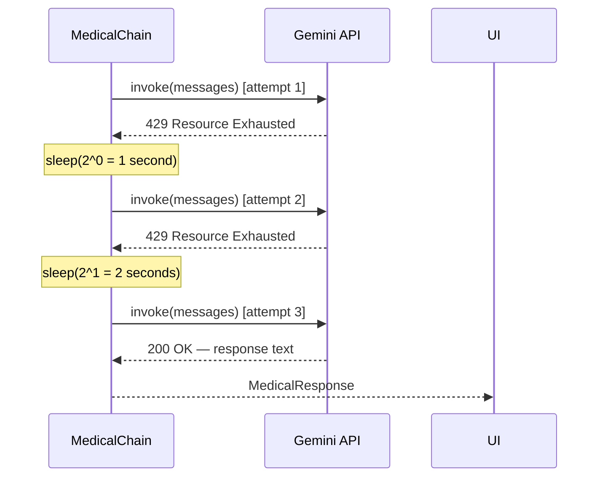

Error categories and their handling:

| Error type | Detection | Action |
|---|---|---|
| Quota / 429 | `"quota"`, `"rate"`, `"429"`, `"resource_exhausted"` | Retry with backoff, then user-friendly message in EN/HI |
| Timeout | `"timeout"`, `"deadline"`, `"timed out"` | One retry, then "request took too long" |
| Auth / 401-403 | `"api_key"`, `"invalid"`, `"401"`, `"403"` | No retry — "check your GEMINI_API_KEY" |
| Content blocked | `"blocked"`, `"safety"`, `"harm"` | No retry — "please rephrase your question" |
| Unknown | any other exception | No retry — generic error message |

### Multimodal `run_with_image()` Flow

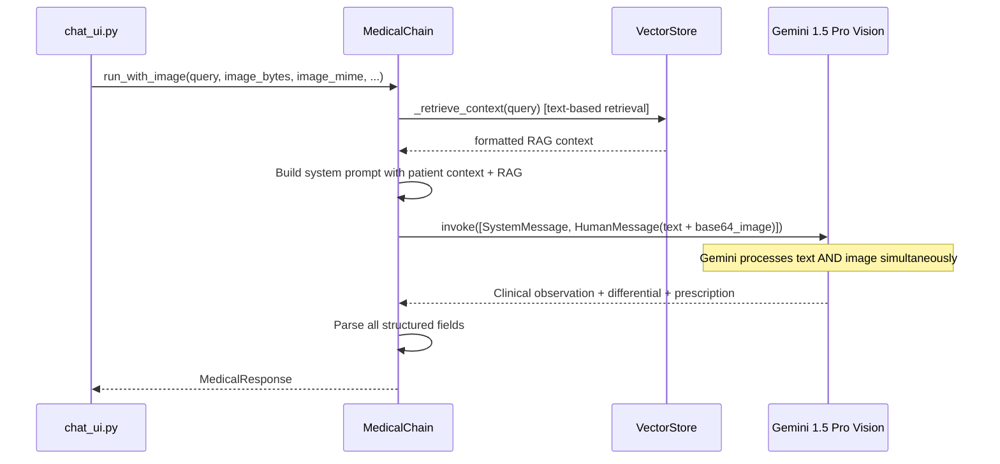

The image is encoded as base64 and embedded in the `HumanMessage` content as a multipart list — exactly the format Gemini's vision API expects. The text query and image are processed simultaneously in a single API call.

---

## 🔄 Complete Core Pipeline — End to End

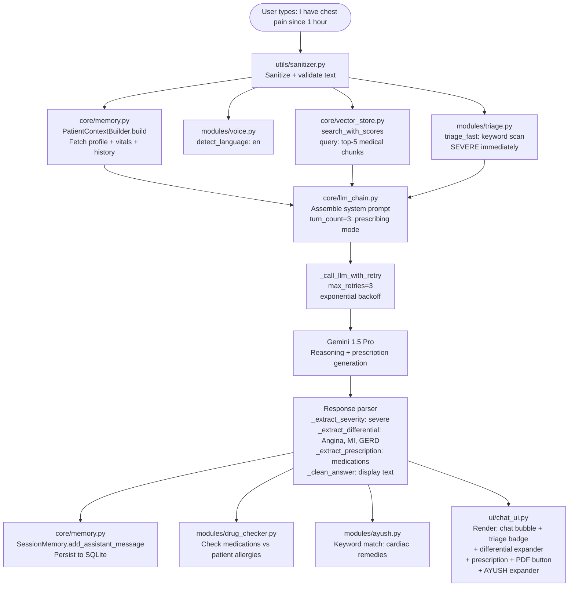

---

## 🧪 Testing Individual Modules

Each `core/` module has a `if __name__ == "__main__":` test block. Run them in isolation:

```bash
# Test database — creates test patient, session, messages, vitals, prescription
python -m core.database

# Test vector store — inserts test docs, searches, cleans up
python -m core.vector_store

# Test ingestion — runs full pipeline on data/medical_kb/
python -m core.ingest

# Test LLM chain — makes real Gemini API call with test patient
python -m core.llm_chain
```

All tests are self-cleaning — they create test data and remove it, leaving the database in its original state.