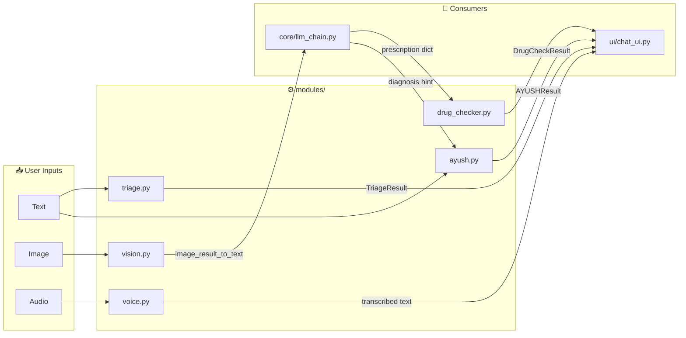
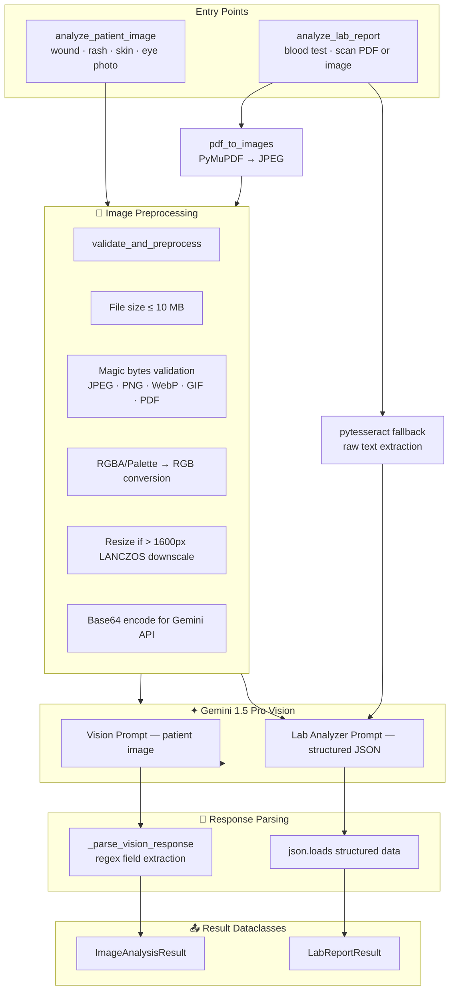
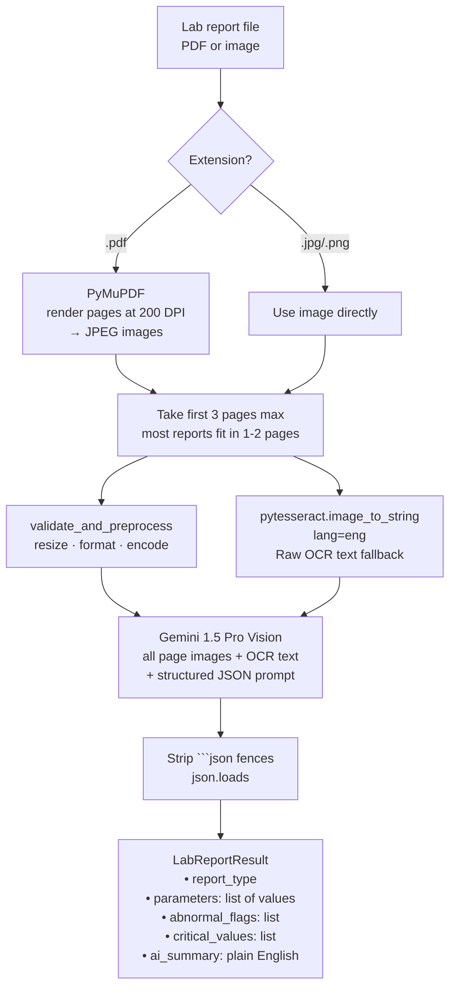
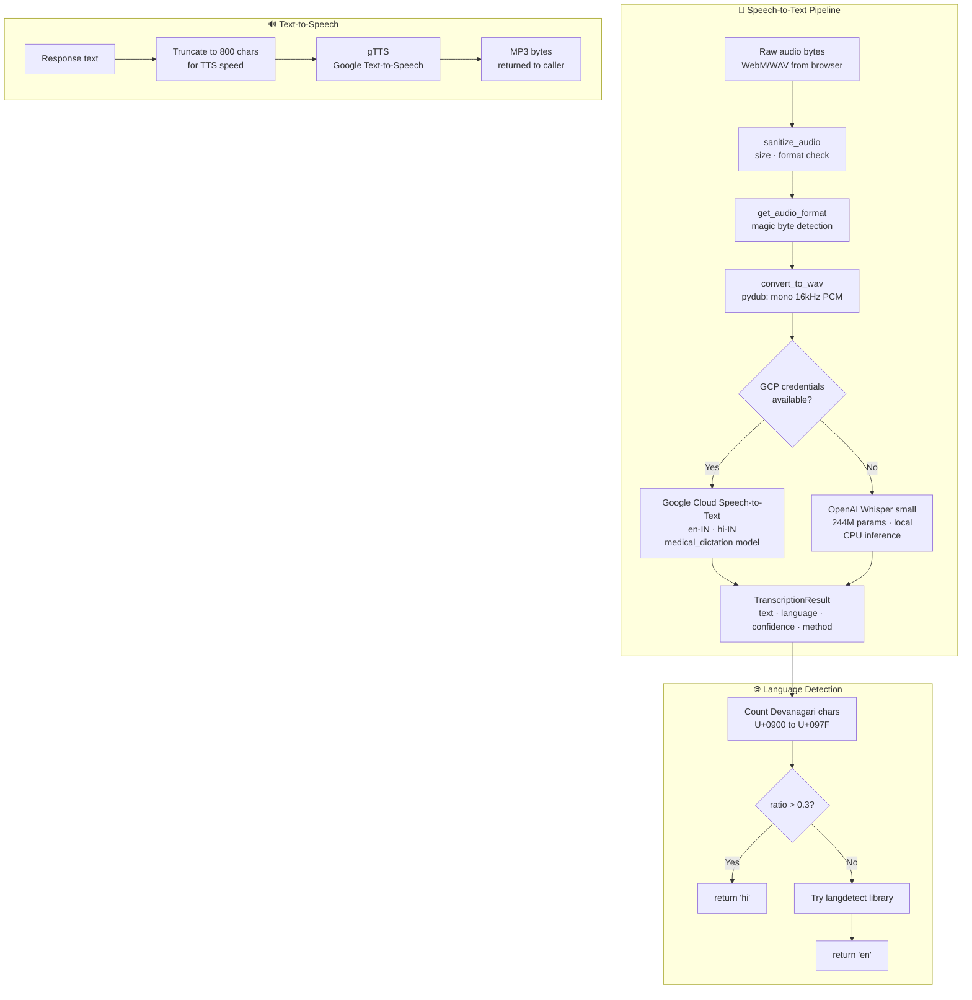
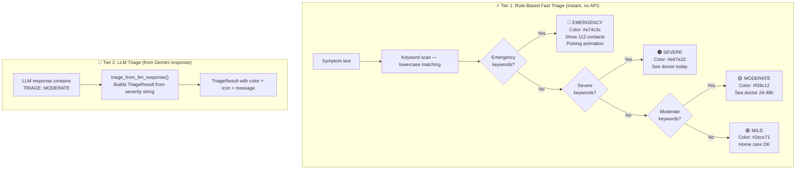
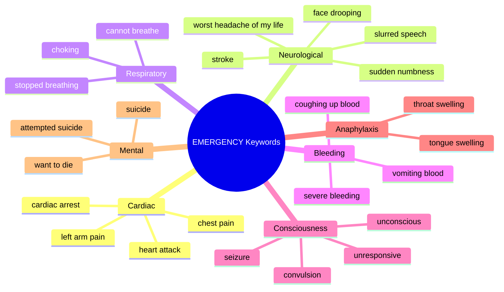
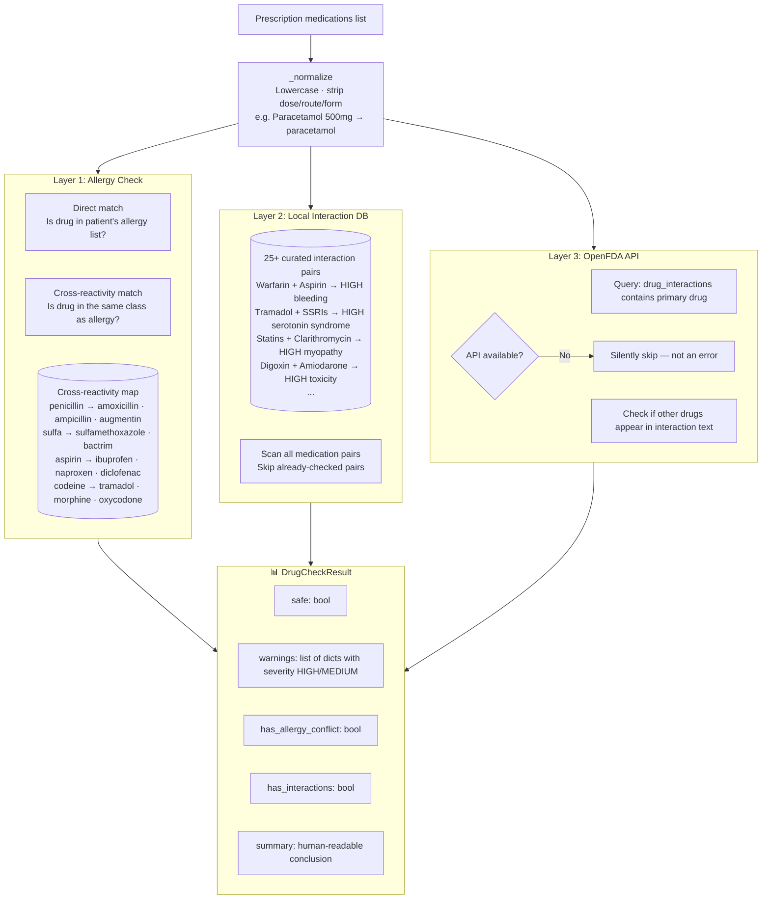
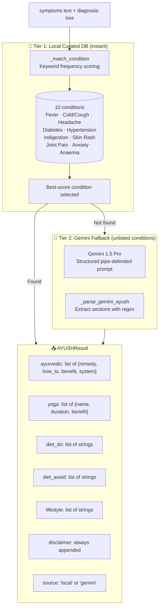

# ⚙️ `modules/` — Specialised AI Modules

The `modules/` directory contains **self-contained AI capabilities** that plug into the main RAG pipeline. Each module owns exactly one specialised concern — vision, voice, triage, drug safety, or Ayurvedic intelligence. None of them orchestrate each other. They are all consumed by `core/llm_chain.py` and `ui/chat_ui.py`.

This separation means each module can be upgraded, replaced, or tested independently without touching the core RAG pipeline.

---

## 📁 File Overview

| Module | Capability | API / Model | Offline fallback |
|---|---|---|---|
| `vision.py` | Image analysis + lab report OCR | Gemini 1.5 Pro Vision | pytesseract OCR |
| `voice.py` | Speech-to-text + text-to-speech | GCP Speech-to-Text + gTTS | OpenAI Whisper |
| `triage.py` | Severity classification + emergency alerts | Rule-based (no API) | — |
| `drug_checker.py` | Drug interaction + allergy checker | Local DB + OpenFDA API | Local DB only |
| `ayush.py` | Ayurvedic remedies engine | Local curated DB + Gemini fallback | Local DB |

---

## 🔗 Module Integration Map



---

## 📄 `vision.py` — Computer Vision & Lab Report AI

### Purpose

`vision.py` is the **eyes of MediAssist AI**. It accepts photos of medical conditions or lab report documents, sends them to Gemini 1.5 Pro's vision capabilities, and returns structured clinical observations that feed directly into the consultation RAG chain.

### Architecture



### Patient Image Analysis

The vision prompt is structured to produce **parseable field-separated output**, not free text:

```
DESCRIPTION: What do you observe in the image?
AFFECTED_AREA: Which body part or region is shown?
VISIBLE_SYMPTOMS: symptom1 | symptom2 | symptom3
POSSIBLE_CONDITIONS: condition1 | condition2 | condition3
SEVERITY: MILD/MODERATE/SEVERE/EMERGENCY
RECOMMENDATIONS: What immediate actions should the patient take?
URGENT_CARE: YES/NO
```

**Why structured format instead of free text?**

Free text from Gemini Vision would require an additional LLM call to extract fields — adding latency and cost. The pipe-separated format can be parsed with a single regex per field, making extraction deterministic and instant.

```python
def extract(label: str) -> str:
    match = re.search(rf"{label}:\s*(.+?)(?=\n[A-Z_]+:|$)", raw,
                      re.IGNORECASE | re.DOTALL)
    return match.group(1).strip() if match else ""
```

### `ImageAnalysisResult` Dataclass

```python
@dataclass
class ImageAnalysisResult:
    description: str              # full visual observation text
    visible_symptoms: list[str]   # ["redness", "swelling", "vesicles"]
    affected_area: str            # "left forearm"
    severity_hint: str            # "mild" | "moderate" | "severe" | "emergency"
    possible_conditions: list[str]# ["contact dermatitis", "eczema", "cellulitis"]
    recommendations: str          # "keep clean, avoid scratching, see dermatologist"
    needs_urgent_care: bool       # True if URGENT_CARE: YES
    raw_response: str             # full Gemini text for debugging
```

### `image_result_to_text()` — RAG Injection

The vision result is converted to a plain text block for injection into the main RAG chain:

```python
def image_result_to_text(result: ImageAnalysisResult) -> str:
    return (
        f"Visual Assessment of Patient Image:\n"
        f"Observation: {result.description}\n"
        f"Affected Area: {result.affected_area}\n"
        f"Visible Symptoms: {', '.join(result.visible_symptoms)}\n"
        f"Possible Conditions (visual only): {', '.join(result.possible_conditions)}\n"
        f"Visual Severity Estimate: {result.severity_hint.upper()}\n"
        f"{'⚠️ URGENT CARE INDICATED based on visual assessment.' if result.needs_urgent_care else ''}"
    )
```

This text block is passed as `image_description` to `MedicalChain.run()`, which appends it to the user query before RAG retrieval. This means the image analysis becomes part of the semantic search — the retrieved KB chunks are relevant to the visual findings.

### Lab Report Analysis Pipeline



**Why 200 DPI for PDF rendering?**

Lab reports are typically scanned at 150–300 DPI. Rendering at 200 DPI provides enough resolution for Gemini Vision to read small printed numbers accurately without producing unnecessarily large image files.

**Why include OCR text alongside the image?**

Gemini Vision occasionally struggles with small fonts or poor scan quality. Including pytesseract's OCR output as additional text context gives Gemini a second reference — the prompt instructs it to reconcile both sources. This redundancy significantly improves parameter extraction accuracy.

### Image Preprocessing — Magic Byte Validation

```python
def _is_valid_image_bytes(data: bytes) -> bool:
    if data[:3] == b"\xff\xd8\xff":   return True  # JPEG
    if data[:4] == b"\x89PNG":        return True  # PNG
    if data[8:12] == b"WEBP":         return True  # WebP (inside RIFF)
    if data[:6] in (b"GIF87a", b"GIF89a"): return True  # GIF
    if data[:4] == b"%PDF":           return True  # PDF
    return False
```

File extensions can be spoofed. Magic byte validation confirms the file is actually the format it claims to be, preventing malicious file uploads from reaching the Gemini API.

---

## 📄 `voice.py` — Multilingual Voice I/O

### Purpose

`voice.py` enables MediAssist AI to be used entirely hands-free — patients can describe symptoms by speaking, and the AI can respond in audio. Critically, it supports **Hindi and English in the same session**, switching dynamically based on what language the patient speaks.

### Architecture



### Google Cloud STT vs Whisper

```mermaid
graph LR
    subgraph GCP["Google Cloud STT (primary)"]
        G1[Cloud API call]
        G2["hi-IN model — Hindi native accuracy"]
        G3[medical_dictation model for English]
        G4[Alternative language codes\nen-IN fallback for hi-IN]
        G5[Returns language_code detected]
    end

    subgraph WHISPER["OpenAI Whisper (fallback)"]
        W1[Local model — 244M params]
        W2[Downloads once to cache]
        W3[fp16=False for CPU safety]
        W4[Returns language detected]
        W5[Works offline — no API needed]
    end

    GCP -->|GCP credentials missing| WHISPER
    GCP -->|Empty transcript returned| WHISPER
```



**Why GCP STT for Hindi?**

Google Cloud's `hi-IN` model is trained specifically on Indian speech patterns, dialects, and the natural Hindi-English code-switching (Hinglish) common in urban India. Whisper's Hindi support is functional but less accurate on colloquial speech and medical terminology in Hindi.

**Why Whisper as fallback?**

The app works without any GCP credentials — Whisper handles both Hindi and English locally. This means the voice feature works out of the box without any GCP account setup. GCP credentials are optional and only needed for superior Hindi quality.

### Audio Format Detection

```python
def get_audio_format(audio_bytes: bytes) -> str:
    if audio_bytes[:4] == b"RIFF":   return "wav"
    if audio_bytes[:3] == b"ID3":    return "mp3"
    if audio_bytes[:4] == b"fLaC":   return "flac"
    return "webm"   # default for Streamlit st.audio_input recordings
```

`st.audio_input` records in WebM format in most browsers. The conversion step (`pydub`) handles WebM → WAV, producing the mono 16kHz format that both GCP STT and Whisper expect.

### `TranscriptionResult` Dataclass

```python
@dataclass
class TranscriptionResult:
    text: str           # transcribed text
    language: str       # 'en' | 'hi' | 'bn' | 'ta' | 'te'
    confidence: float   # 0.0-1.0 (Whisper always returns 0.85 — no per-segment confidence)
    method: str         # 'google_cloud' | 'whisper' | 'failed'
    error: Optional[str]# error message if failed
```

### Language Detection Algorithm

```python
def detect_language(text: str) -> str:
    # Primary: count Devanagari Unicode codepoints
    devanagari_count = sum(1 for ch in text if "\u0900" <= ch <= "\u097F")
    ratio = devanagari_count / max(len(text.replace(" ", "")), 1)

    if ratio > 0.3:  # > 30% Devanagari characters → Hindi
        return "hi"

    # Secondary: langdetect statistical model
    try:
        from langdetect import detect
        detected = detect(text)
        if detected in ("hi", "bn", "ta", "te"):
            return detected
    except Exception:
        pass

    return "en"
```

The 30% Devanagari threshold handles Hinglish gracefully — a sentence like "Mujhe बुखार है" has 30%+ Devanagari and correctly classifies as Hindi, even though it contains Roman script too.

### Language Mappings

| Our code | GCP STT | gTTS | Whisper |
|---|---|---|---|
| `en` | `en-IN` | `en` | `en` |
| `hi` | `hi-IN` | `hi` | `hi` |
| `bn` | `bn-IN` | `bn` | `bn` |
| `ta` | `ta-IN` | `ta` | `ta` |
| `te` | `te-IN` | `te` | `te` |

Indian locale codes (`en-IN`, `hi-IN`) are used throughout — GCP's Indian English model is trained on Indian accents, significantly improving accuracy over the generic `en-US` model.

---

## 📄 `triage.py` — Clinical Severity Classification

### Purpose

`triage.py` classifies the **medical urgency** of a patient's symptoms without any API call. It runs **before** the LLM and displays a triage badge instantly — giving the patient immediate visual feedback while the full RAG chain processes.

### Two-Tier Architecture



### Emergency Keyword Coverage

The emergency keyword set covers all major acute medical categories:



**Mental health emergencies** are included because self-harm and suicide ideation require immediate intervention. When these keywords are detected, the EMERGENCY badge appears with the same prominence as cardiac events.

### `TriageResult` Dataclass

```python
@dataclass
class TriageResult:
    severity: str                      # mild | moderate | severe | emergency
    color: str                         # hex color for UI badge
    icon: str                          # 🟢 🟡 🟠 🔴
    label: str                         # "Mild" | "Moderate" | "Severe" | "EMERGENCY"
    message: str                       # advice message for UI display
    emergency_contacts: list[dict]     # [{"National Emergency": "112", ...}]
    specialist_hint: str               # "Consider seeing a Cardiologist"
    rule_triggered: str                # which keyword matched (for debugging)
```

### `get_specialist_hint()` — Automatic Referral Detection

```python
mapping = {
    "Cardiologist":       ["chest", "heart", "palpitation", "cardiac"],
    "Neurologist":        ["headache", "migraine", "seizure", "numbness", "stroke"],
    "Dermatologist":      ["rash", "skin", "acne", "eczema", "psoriasis", "wound"],
    "Pulmonologist":      ["lung", "breath", "asthma", "cough", "respiratory"],
    "Gastroenterologist": ["stomach", "abdomen", "liver", "bowel", "digestion"],
    "Pediatrician":       ["child", "baby", "infant", "toddler"],
    ...
}
```

When a specialist is identified from symptoms, the UI shows a warning card:
> 👨‍⚕️ **Specialist Recommended**: Consider consulting a **Dermatologist** for this condition.

This supplements the LLM's `[REFER: Dermatologist]` tag extraction — two independent signals increase the chance of an appropriate referral being surfaced.

---

## 📄 `drug_checker.py` — Interaction & Allergy Safety

### Purpose

`drug_checker.py` is the **patient safety gate** for prescriptions. Before any prescription is offered for download, every medication is checked against the patient's known allergies and against a curated database of dangerous drug combinations. This prevents a real-world class of prescription errors that injure patients annually.

### Three-Layer Safety Check



### Curated Interaction Database — Selected Entries

| Drug A | Drug B | Severity | Clinical consequence |
|---|---|---|---|
| Warfarin | Aspirin | HIGH | Severe bleeding risk |
| Warfarin | Ibuprofen | HIGH | Severe bleeding risk |
| Tramadol | Sertraline | HIGH | Serotonin syndrome |
| Tramadol | Fluoxetine | HIGH | Serotonin syndrome |
| Simvastatin | Clarithromycin | HIGH | Myopathy, rhabdomyolysis |
| Atorvastatin | Clarithromycin | HIGH | Myopathy |
| Digoxin | Amiodarone | HIGH | Digoxin toxicity |
| Digoxin | Clarithromycin | HIGH | Digoxin toxicity |
| Metronidazole | Alcohol | HIGH | Severe nausea, vomiting, flushing |
| Ciprofloxacin | Antacid | MEDIUM | Reduced absorption |
| Metformin | Alcohol | MEDIUM | Lactic acidosis risk |
| Ibuprofen | Lisinopril | MEDIUM | Reduced ACE inhibitor efficacy |
| Tetracycline | Calcium | MEDIUM | Reduced absorption |

### Why OpenFDA as Layer 3?

The OpenFDA Drug Label API is a free, publicly accessible database of FDA-approved drug label content. Drug labels contain "Drug Interactions" sections that explicitly name problematic combinations. Layer 3 queries this for the primary drug and checks if any other prescribed medications appear in the interaction text — catching combinations that weren't in the curated local database.

The OpenFDA check is **best-effort**: if the API is unreachable (no internet, API down), it silently passes. The local database (Layer 2) always runs. This design ensures the checker works offline without crashing.

### `DrugCheckResult` Output Examples

```python
# Safe prescription
DrugCheckResult(
    safe=True,
    summary="✅ No known interactions found among 3 medication(s).",
    warnings=[]
)

# Unsafe — allergy conflict
DrugCheckResult(
    safe=False,
    has_allergy_conflict=True,
    warnings=[{
        "type": "allergy",
        "severity": "high",
        "drugs": ["amoxicillin"],
        "message": "⚠️ ALLERGY ALERT: Patient is allergic to 'penicillin'. "
                   "'Amoxicillin' may cause an allergic reaction. Do NOT administer."
    }],
    summary="⚠️ 1 issue(s) found: 1 high severity. Review before dispensing."
)
```

---

## 📄 `ayush.py` — Ayurvedic Intelligence Engine

### Purpose

`ayush.py` provides **culturally relevant, evidence-informed complementary medicine suggestions** alongside allopathic recommendations. For India's 1.3 billion people — where Ayurvedic practice predates modern medicine by thousands of years — this is not a novelty feature. It is a first-class clinical output.

### Two-Tier Architecture



### Curated Knowledge Base — Depth Example (Diabetes)

The local database for diabetes includes:

**Ayurvedic Remedies:**
- **Karela (Bitter Gourd) Juice** — 30ml on empty stomach. Contains polypeptide-p which mimics insulin action. Evidence: multiple clinical studies on glycemic control.
- **Vijaysar (Indian Kino) Water** — Soak wooden tumbler overnight. Evidence: clinically studied reduction in blood sugar and improved insulin sensitivity.
- **Methi (Fenugreek) Seeds** — soak overnight, eat with water. High soluble fiber slows glucose absorption, shown to lower HbA1c in trials.
- **Jamun Seed Powder** — Jamboline inhibits starch-to-sugar conversion. Traditional Ayurvedic remedy with biochemical rationale.

**Yoga Recommendations:**
- **Mandukasana** — massages pancreas, stimulates insulin production
- **Dhanurasana** — stimulates pancreatic function
- **Kapalbhati + Anulom Vilom** — reduces cortisol, which directly raises blood sugar
- **Brisk walking 30-45 min** — most effective lifestyle intervention

**Dietary guidance and lifestyle tips** with clear clinical rationale for each recommendation.

### Keyword Matching System

```python
CONDITION_KEYWORDS = {
    "fever":          ["fever", "bukhaar", "temperature", "pyrexia", "viral"],
    "cold and cough": ["cold", "cough", "khansi", "sardi", "runny nose", "flu"],
    "diabetes":       ["diabetes", "sugar", "blood sugar", "hyperglycemia", "madhumeh"],
    "anxiety":        ["anxiety", "stress", "depression", "tension", "insomnia"],
    ...
}
```

Hindi keyword variants (`bukhaar`, `khansi`, `madhumeh`) are included alongside English — a patient typing in Hindi will still match the correct condition. This is intentional: AYUSH suggestions are most valuable to Hindi-speaking users who are most likely to practice Ayurveda.

### The Gemini Fallback Prompt

For conditions not in the local database, Gemini is prompted with a **pipe-delimited structured format** that can be parsed deterministically:

```
AYURVEDIC_REMEDIES:
1. Remedy Name | How to prepare/use | Benefit | System: Ayurveda
2. ...

YOGA:
1. Pose/Pranayama name | Duration | Benefit
2. ...

DIET_DO:
- what to eat/drink

DIET_AVOID:
- what to avoid
```

The pipe delimiter and numbered format allow `_parse_gemini_ayush()` to split each line and extract structured fields without a second LLM call.

### Disclaimer — Always Appended

```python
DISCLAIMER = (
    "⚠️ AYUSH Disclaimer: These suggestions are traditional/complementary remedies "
    "for general wellness support. They are NOT a replacement for prescribed medical treatment. "
    "Always consult a qualified doctor before stopping or changing any medication. "
    "For serious conditions, follow your allopathic treatment first."
)
```

The disclaimer is **not optional** — it is hardcoded into `AYUSHResult.disclaimer` and always displayed in the UI expander. This prevents the AYUSH suggestions from being interpreted as replacements for evidence-based treatment.

---

## 🧪 Testing Each Module

```bash
# Vision module — tests preprocessing + makes real Gemini Vision API call
python test_modules.py vision

# Voice module — tests language detection, TTS (saves MP3), STT pipeline
python test_modules.py voice

# Triage module — tests all 5 severity levels with known symptom strings
python -m modules.triage

# Drug checker — tests Warfarin + Aspirin interaction detection
python -m modules.drug_checker

# AYUSH module — tests 4 conditions against local DB
python -m modules.ayush
```

All tests produce `✅` / `⚠️` / `❌` output and are self-contained — they don't modify any patient data.

---

## 📊 Module Performance Characteristics

| Module | Response time | API dependency | Works offline? |
|---|---|---|---|
| `triage.py` (fast) | < 1ms | None | ✅ Always |
| `drug_checker.py` (local) | < 5ms | None | ✅ Always |
| `ayush.py` (local match) | < 10ms | None | ✅ Always |
| `voice.py` (Whisper STT) | 2–8s | None | ✅ After model download |
| `drug_checker.py` (OpenFDA) | 200–500ms | OpenFDA API | ⚠️ Gracefully skipped |
| `ayush.py` (Gemini fallback) | 1–3s | Gemini API | ❌ Returns None |
| `vision.py` (image analysis) | 2–5s | Gemini Vision | ❌ Fails gracefully |
| `voice.py` (GCP STT) | 1–3s | GCP Speech API | ❌ Falls back to Whisper |